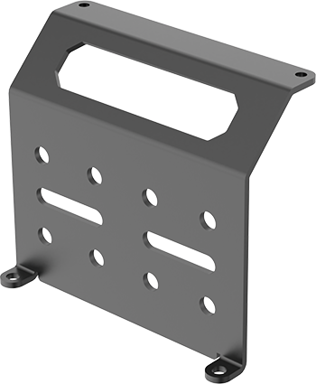
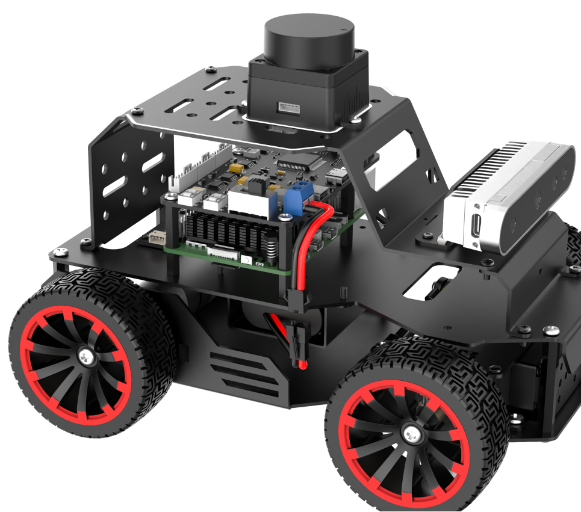
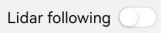
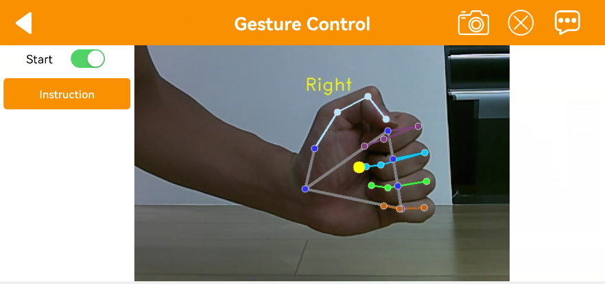

# 1. Getting Ready

## 1.1 MentorPi Introduction

**1.1.1 Product Introduction**

MentorPi is a ROS2 robot powered by the Raspberry Pi 5. It comes in two variants: MentorPi-M1, which features a Mecanum-wheel chassis, and MentorPi-A1, equipped with an Ackermann chassis. Both models are built with high-performance hardware, including a TOF Lidar and a 3D depth camera, enabling advanced functionalities such as mapping, navigation, path planning, image recognition, vision tracking, and human-robot interaction.

**1.1.2 Usage Precautions**

Please pay attention to the following points when using and storing this product:

(1) This product contains conductive components. Avoid contact with metal objects when powered on.

(2) After the robot is powered on, do not forcibly move the servo, as this may cause damage.

(3) If the robot runs for an extended period, the servos may become hot. Allow the robot to "**rest**" and wait for the servos to cool before resuming operation.

(4) Keep your face, glasses, and other body parts away from the robot while it is operating. Do not place fingers within the joint movement range to prevent injury. Also, be cautious of falls from high edges.

(5) The robot's servos are precision components and consumable parts. They may need replacement after long-term or intensive use.

(6) If the product will not be used for an extended period, fully charge the battery, remove it, and store it in a cool, dry place.

**1.1.3 Copyright Notice**

This manual is the property of Shenzhen Hiwonder Technology Co., Ltd. No organization or individual is permitted to reproduce, copy, translate, or distribute any content from this manual without authorization. Any unauthorized use or infringement of this manual's copyright will be subject to legal action by our company.

**1.1.4 Disclaimer**

The product described in this manual (including hardware, software, etc.) is provided "**as is**". Every effort has been made to ensure the accuracy of this manual, but we cannot guarantee it is completely free from errors or omissions. This document is regularly reviewed, and we welcome feedback for improvements. Product features and specifications may change with version upgrades. For the latest product information, please contact customer service when placing your order. Furthermore, unless explicitly stated by Hiwonder, we are not responsible for any losses resulting from product malfunctions or damage under extreme conditions outside of typical use cases.

## 1.2 Packing List

**(1) MentorPi M1 (Monocular camera version)**

<table border="1" class="docutils-nobg" style="text-align: center;">
<thead>
<tr>
<th><strong>No.</strong></th>
<th >Components</th>
<th><strong>Quantity</strong></th>
<th><strong>Picture</strong></th>
</tr>
</thead>
<tbody>
<tr>
<td>1</td>
<td>M1 (Mecanum) Chassis (Assembled; Battery included)</td>
<td>1</td>
<td></td>
</tr>
<tr>
<td>2</td>
<td>Controller top cover</td>
<td>1</td>
<td></td>
</tr>
<tr>
<td>3</td>
<td>Front cover</td>
<td>1</td>
<td></td>
</tr>
<tr>
<td>4</td>
<td>Rear cover</td>
<td>1</td>
<td></td>
</tr>
<tr>
<td>5</td>
<td>Raspberry Pi 5 (optional)</td>
<td>1</td>
<td></td>
</tr>
<tr>
<td>6</td>
<td>RRC Lite controller</td>
<td>1</td>
<td></td>
</tr>
<tr>
<td>7</td>
<td>Cooling fan</td>
<td>1</td>
<td></td>
</tr>
<tr>
<td>8</td>
<td>Raspberry Pi power supply cable</td>
<td>1</td>
<td></td>
</tr>
<tr>
<td>9</td>
<td>RRC data cable</td>
<td>1</td>
<td></td>
</tr>
<tr>
<td>10</td>
<td>64GB SD card (optional)</td>
<td>1</td>
<td></td>
</tr>
<tr>
<td>11</td>
<td>Card reader</td>
<td>1</td>
<td></td>
</tr>
<tr>
<td>12</td>
<td>Battery cable</td>
<td>1</td>
<td></td>
</tr>
<tr>
<td>13</td>
<td>Lidar</td>
<td>1</td>
<td></td>
</tr>
<tr>
<td>14</td>
<td>4PIN Lidar wire</td>
<td style="text-align: center;">1</td>
<td></td>
</tr>
<tr>
<td>15</td>
<td>Lidar data cable</td>
<td>1</td>
<td></td>
</tr>
<tr>
<td>16</td>
<td>8.4V 2A charger (DC5.5 * 2.5 male connector)</td>
<td>1</td>
<td></td>
</tr>
<tr>
<td>17</td>
<td>Monocular camera</td>
<td>1</td>
<td></td>
</tr>
<tr>
<td>18</td>
<td>Wireless handle and Handle receiver</td>
<td>1</td>
<td></td>
</tr>
<tr>
<td>19</td>
<td>EVA ball</td>
<td>1</td>
<td></td>
</tr>
<tr>
<td>20</td>
<td>Accessory bag (Screwdriver * 1 M2.5 * 20 Double-pass nylon column <em>6 M3 </em>6 Black round head screw * 14 M2 <em>6 Round head screw * 4 M2.5 </em>6 Round head screw * 10 M2.5 * 10+6 Single-pass nylon column * 1)</td>
<td>1</td>
<td></td>
</tr>
<tr>
<td>21</td>
<td>User manual</td>
<td>1</td>
<td></td>
</tr>
</tbody>
</table>

**(2) MentorPi M1 (Depth camera version)**

<table border="1" class="docutils-nobg" style="text-align: center;">
<thead>
<tr>
<th><strong>No.</strong></th>
<th>Components</th>
<th><strong>Quantity</strong></th>
<th><strong>Picture</strong></th>
</tr>
</thead>
<tbody>
<tr>
<td>1</td>
<td>M1 (Mecanum) Chassis (Assembled; Battery included)</td>
<td>1</td>
<td></td>
</tr>
<tr>
<td>2</td>
<td>Controller top cover</td>
<td>1</td>
<td></td>
</tr>
<tr>
<td>3</td>
<td>Front cover</td>
<td>1</td>
<td></td>
</tr>
<tr>
<td>4</td>
<td>Rear cover</td>
<td>1</td>
<td></td>
</tr>
<tr>
<td>5</td>
<td>Raspberry Pi 5 (optional)</td>
<td>1</td>
<td></td>
</tr>
<tr>
<td>6</td>
<td>RRC Lite controller</td>
<td>1</td>
<td></td>
</tr>
<tr>
<td>7</td>
<td>Cooling fan</td>
<td>1</td>
<td></td>
</tr>
<tr>
<td>8</td>
<td>Raspberry Pi power supply cable</td>
<td>1</td>
<td></td>
</tr>
<tr>
<td>9</td>
<td>RRC data cable</td>
<td>1</td>
<td></td>
</tr>
<tr>
<td>10</td>
<td>64GB SD card (optional)</td>
<td>1</td>
<td></td>
</tr>
<tr>
<td>11</td>
<td>Card reader</td>
<td>1</td>
<td></td>
</tr>
<tr>
<td>12</td>
<td>Battery cable</td>
<td>1</td>
<td></td>
</tr>
<tr>
<td>13</td>
<td>Lidar</td>
<td>1</td>
<td></td>
</tr>
<tr>
<td>14</td>
<td>4PIN Lidar wire</td>
<td>1</td>
<td></td>
</tr>
<tr>
<td>15</td>
<td>Lidar data cable</td>
<td>1</td>
<td></td>
</tr>
<tr>
<td>16</td>
<td>8.4V 2A charger  (DC5.5 * 2.5 male connector)</td>
<td>1</td>
<td></td>
</tr>
<tr>
<td>17</td>
<td>Depth camera</td>
<td>1</td>
<td></td>
</tr>
<tr>
<td>18</td>
<td>Wireless handle and Handle receiver</td>
<td>1</td>
<td></td>
</tr>
<tr>
<td>19</td>
<td>EVA ball</td>
<td>1</td>
<td></td>
</tr>
<tr>
<td>20</td>
<td>Accessory bag (Screwdriver * 1 M2.5 * 20 Double-pass nylon column <em>6 M3 </em>6 Black round head screw * 14 M2 <em>6 Round head screw * 4 M2.5 </em>6 Round head screw * 10 M2.5 * 10+6 Single-pass nylon column * 1)</td>
<td>1</td>
<td></td>
</tr>
<tr>
<td>21</td>
<td>User manual</td>
<td>1</td>
<td></td>
</tr>
</tbody>
</table>

**(3) MentorPi M1 Packing List(Depth Camara Version)**

<table border="1" class="docutils-nobg" style="text-align: center;">
<thead>
<tr>
<th><strong>No.</strong></th>
<th>Components</th>
<th><strong>Quantity</strong></th>
<th><strong>Picture</strong></th>
</tr>
</thead>
<tbody>
<tr>
<td>1</td>
<td>M1 (Mecanum) Chassis (Assembled; Battery included)</td>
<td>1</td>
<td></td>
</tr>
<tr>
<td>2</td>
<td>Controller top cover</td>
<td>1</td>
<td></td>
</tr>
<tr>
<td>3</td>
<td>Front cover</td>
<td>1</td>
<td></td>
</tr>
<tr>
<td>4</td>
<td>Rear cover</td>
<td>1</td>
<td></td>
</tr>
<tr>
<td>5</td>
<td>Raspberry Pi 5 (optional)</td>
<td>1</td>
<td></td>
</tr>
<tr>
<td>6</td>
<td>RRC Lite controller</td>
<td>1</td>
<td></td>
</tr>
<tr>
<td>7</td>
<td>Cooling fan</td>
<td>1</td>
<td></td>
</tr>
<tr>
<td>8</td>
<td>Raspberry Pi power supply cable</td>
<td>1</td>
<td></td>
</tr>
<tr>
<td>9</td>
<td>RRC data cable</td>
<td>1</td>
<td></td>
</tr>
<tr>
<td>10</td>
<td>64GB SD card (optional)</td>
<td>1</td>
<td></td>
</tr>
<tr>
<td>11</td>
<td>Card reader</td>
<td>1</td>
<td></td>
</tr>
<tr>
<td>12</td>
<td>Battery cable</td>
<td>1</td>
<td></td>
</tr>
<tr>
<td>13</td>
<td>Lidar</td>
<td>1</td>
<td></td>
</tr>
<tr>
<td>14</td>
<td>4PIN Lidar wire</td>
<td>1</td>
<td></td>
</tr>
<tr>
<td>15</td>
<td>Lidar data cable</td>
<td>1</td>
<td></td>
</tr>
<tr>
<td>16</td>
<td>8.4V 2A charger  (DC5.5 * 2.5 male connector)</td>
<td>1</td>
<td></td>
</tr>
<tr>
<td>17</td>
<td>Depth camera</td>
<td>1</td>
<td></td>
</tr>
<tr>
<td>18</td>
<td>Wireless handle and Handle receiver</td>
<td>1</td>
<td></td>
</tr>
<tr>
<td>19</td>
<td>EVA ball</td>
<td>1</td>
<td></td>
</tr>
<tr>
<td>20</td>
<td>Accessory bag (Screwdriver * 1 M2.5 * 20 Double-pass nylon column <em>6 M3 </em>6 Black round head screw * 14 M2 <em>6 Round head screw * 4 M2.5 </em>6 Round head screw * 10 M2.5 * 10+6 Single-pass nylon column * 1)</td>
<td>1</td>
<td></td>
</tr>
<tr>
<td>21</td>
<td>WonderEcho Pro
Al voice interactian box
+ Type C cable</td>
<td>1</td>
<td></td>
</tr>    
<tr>
<td>22</td>
<td>User manual</td>
<td>1</td>
<td></td>
</tr>
</tbody>
</table>

**(4) MentorPi A1 Packing List(Monocular Camera Version)**

<table border="1" class="docutils-nobg" style="text-align: center;">
<thead>
<tr>
<th><strong>No.</strong></th>
<th>Components</th>
<th><strong>Quantity</strong></th>
<th><strong>Picture</strong></th>
</tr>
</thead>
<tbody>
<tr>
<td>1</td>
<td>A1 (Ackerman) Chassis (Assembled; Battery included)</td>
<td>1</td>
<td></td>
</tr>
<tr>
<td>2</td>
<td>Controller top cover</td>
<td>1</td>
<td></td>
</tr>
<tr>
<td>3</td>
<td>Front cover</td>
<td>1</td>
<td></td>
</tr>
<tr>
<td>4</td>
<td>Rear cover</td>
<td>1</td>
<td></td>
</tr>
<tr>
<td>5</td>
<td>Raspberry Pi 5 (optional)</td>
<td>1</td>
<td></td>
</tr>
<tr>
<td>6</td>
<td>RRC Lite controller</td>
<td>1</td>
<td></td>
</tr>
<tr>
<td>7</td>
<td>Cooling fan</td>
<td>1</td>
<td></td>
</tr>
<tr>
<td>8</td>
<td>Raspberry Pi power supply cable</td>
<td>1</td>
<td></td>
</tr>
<tr>
<td>9</td>
<td>RRC data cable</td>
<td>1</td>
<td></td>
</tr>
<tr>
<td>10</td>
<td>64GB SD card (optional)</td>
<td>1</td>
<td></td>
</tr>
<tr>
<td>11</td>
<td>Card reader</td>
<td>1</td>
<td></td>
</tr>
<tr>
<td>12</td>
<td>Battery cable</td>
<td>1</td>
<td></td>
</tr>
<tr>
<td>13</td>
<td>Lidar</td>
<td>1</td>
<td></td>
</tr>
<tr>
<td>14</td>
<td>4PIN Lidar wire</td>
<td>1</td>
<td></td>
</tr>
<tr>
<td>15</td>
<td>Lidar data cable</td>
<td>1</td>
<td></td>
</tr>
<tr>
<td>16</td>
<td>8.4V 2A charger (DC5.5 * 2.5 male connector)</td>
<td>1</td>
<td></td>
</tr>
<tr>
<td>17</td>
<td>Monocular camera</td>
<td>1</td>
<td></td>
</tr>
<tr>
<td>18</td>
<td>Wireless handle and Handle receiver</td>
<td>1</td>
<td></td>
</tr>
<tr>
<td>19</td>
<td>EVA ball</td>
<td>1</td>
<td></td>
</tr>
<tr>
<td>20</td>
<td>Accessory bag (Screwdriver * 1  M2.5 * 20 Double-pass nylon column <em>6 M3 </em>6 Black round head screw * 14 M2 <em>6 Round head screw * 4 M2.5 </em>6 Round head screw * 10 M2.5 * 10+6 Single-pass nylon column * 1)</td>
<td>1</td>
<td></td>
</tr>
<tr>
<td>21</td>
<td>User manual</td>
<td>1</td>
<td></td>
</tr>
</tbody>
</table>

**(5) MentorPi A1 Packing List(Depth camera Version)**

<table border="1" class="docutils-nobg" style="text-align: center;">
<thead>
<tr>
<th><strong>No.</strong></th>
<th>Components</th>
<th><strong>Quantity</strong></th>
<th><strong>Picture</strong></th>
</tr>
</thead>
<tbody>
<tr>
<td>1</td>
<td>A1 (Ackerman) Chassis (Assembled; Battery included)</td>
<td>1</td>
<td></td>
</tr>
<tr>
<td>2</td>
<td>Controller top cover</td>
<td>1</td>
<td></td>
</tr>
<tr>
<td>3</td>
<td>Front cover</td>
<td>1</td>
<td></td>
</tr>
<tr>
<td>4</td>
<td>Rear cover</td>
<td>1</td>
<td></td>
</tr>
<tr>
<td>5</td>
<td>Raspberry Pi 5 (optional)</td>
<td>1</td>
<td></td>
</tr>
<tr>
<td>6</td>
<td>RRC Lite controller</td>
<td>1</td>
<td></td>
</tr>
<tr>
<td>7</td>
<td>Cooling fan</td>
<td>1</td>
<td></td>
</tr>
<tr>
<td>8</td>
<td>Raspberry Pi power supply cable</td>
<td>1</td>
<td></td>
</tr>
<tr>
<td>9</td>
<td>RRC data cable</td>
<td>1</td>
<td></td>
</tr>
<tr>
<td>10</td>
<td>64GB SD card (optional)</td>
<td>1</td>
<td></td>
</tr>
<tr>
<td>11</td>
<td>Card reader</td>
<td>1</td>
<td></td>
</tr>
<tr>
<td>12</td>
<td>Battery cable</td>
<td>1</td>
<td></td>
</tr>
<tr>
<td>13</td>
<td>Lidar</td>
<td>1</td>
<td></td>
</tr>
<tr>
<td>14</td>
<td>4PIN Lidar wire</td>
<td>1</td>
<td></td>
</tr>
<tr>
<td>15</td>
<td>Lidar data cable</td>
<td>1</td>
<td></td>
</tr>
<tr>
<td>16</td>
<td>8.4V 2A charger (DC5.5 * 2.5 male connector)</td>
<td>1</td>
<td></td>
</tr>
<tr>
<td>17</td>
<td>Depth camera</td>
<td>1</td>
<td></td>
</tr>
<tr>
<td>18</td>
<td>Wireless handle and Handle receiver</td>
<td>1</td>
<td></td>
</tr>
<tr>
<td>19</td>
<td>EVA ball</td>
<td>1</td>
<td></td>
</tr>
<tr>
<td>20</td>
<td>Accessory bag (Screwdriver*1 M2.5 * 20 Double-pass nylon column <em>6 M3 </em>6 Black round head screw * 14 M2 <em>6 Round head screw * 4 M2.5 </em>6 Round head screw * 10 M2.5 * 10+6 Single-pass nylon column * 1)</td>
<td>1</td>
<td></td>
</tr>
<tr>
<td>21</td>
<td>User manual</td>
<td>1</td>
<td></td>
</tr>
</tbody>
</table>

**(6) MentorPi A1 Advanced Packing List(Depth camera Version)**

<table border="1" class="docutils-nobg" style="text-align: center;">
<thead>
<tr>
<th><strong>No.</strong></th>
<th>Components</th>
<th><strong>Quantity</strong></th>
<th><strong>Picture</strong></th>
</tr>
</thead>
<tbody>
<tr>
<td>1</td>
<td>A1 (Ackerman) Chassis (Assembled; Battery included)</td>
<td>1</td>
<td></td>
</tr>
<tr>
<td>2</td>
<td>Controller top cover</td>
<td>1</td>
<td></td>
</tr>
<tr>
<td>3</td>
<td>Front cover</td>
<td>1</td>
<td></td>
</tr>
<tr>
<td>4</td>
<td>Rear cover</td>
<td>1</td>
<td></td>
</tr>
<tr>
<td>5</td>
<td>Raspberry Pi 5 (optional)</td>
<td>1</td>
<td></td>
</tr>
<tr>
<td>6</td>
<td>RRC Lite controller</td>
<td>1</td>
<td></td>
</tr>
<tr>
<td>7</td>
<td>Cooling fan</td>
<td>1</td>
<td></td>
</tr>
<tr>
<td>8</td>
<td>Raspberry Pi power supply cable</td>
<td>1</td>
<td></td>
</tr>
<tr>
<td>9</td>
<td>RRC data cable</td>
<td>1</td>
<td></td>
</tr>
<tr>
<td>10</td>
<td>64GB SD card (optional)</td>
<td>1</td>
<td></td>
</tr>
<tr>
<td>11</td>
<td>Card reader</td>
<td>1</td>
<td></td>
</tr>
<tr>
<td>12</td>
<td>Battery cable</td>
<td>1</td>
<td></td>
</tr>
<tr>
<td>13</td>
<td>Lidar</td>
<td>1</td>
<td></td>
</tr>
<tr>
<td>14</td>
<td>4PIN Lidar wire</td>
<td>1</td>
<td></td>
</tr>
<tr>
<td>15</td>
<td>Lidar data cable</td>
<td>1</td>
<td></td>
</tr>
<tr>
<td>16</td>
<td>8.4V 2A charger (DC5.5 * 2.5 male connector)</td>
<td>1</td>
<td></td>
</tr>
<tr>
<td>17</td>
<td>Depth camera</td>
<td>1</td>
<td></td>
</tr>
<tr>
<td>18</td>
<td>Wireless handle and Handle receiver</td>
<td>1</td>
<td></td>
</tr>
<tr>
<td>19</td>
<td>EVA ball</td>
<td>1</td>
<td></td>
</tr>
<tr>
<td>20</td>
<td>Accessory bag (Screwdriver * 1 M2.5 * 20 Double-pass nylon column <em>6 M3 </em>6 Black round head screw * 14 M2 <em>6 Round head screw * 4 M2.5 </em>6 Round head screw * 10 M2.5 * 10+6 Single-pass nylon column * 1)</td>
<td>1</td>
<td></td>
</tr>
<tr>
<td>21</td>
<td>WonderEcho Pro
Al voice interactian box
+ Type C cable</td>
<td>1</td>
<td></td>
</tr>
<tr>
<td>22</td>
<td>User manual</td>
<td>1</td>
<td></td>
</tr>
</tbody>
</table>

## 1.3 Charging & Usage Guide

**1.3.1 Charging Instruction**

For delivery safety, the LiPo battery is not fully charged. Please fully charge the battery before the first operation. To do so, connect the battery to the battery connector before the first charge. The charging time is approximately one hour.

**1.3.2 Battery Usage Guideline**

**(1) Charging**: Please charge the battery using the provided charger when the voltage drops below 6.4V. This helps maintain stable operation of the robot.

**(2) Long-Term Storage**: If the robot will not be used for an extended period, fully charge the battery beforehand. Switch the expansion board to "**OFF**" and disconnect the battery wires. 

**(3) Storage Environment**: Store the battery in a cool, dry place to prevent damage caused by overheating or moisture, which can shorten battery life.

**(4) Handling Precautions**: Do not hit, throw, or step on the battery.

**(5) Usage Conditions**: Do not use the battery in environments with strong electrostatic or magnetic fields, as this may damage the battery's safety protection circuitry.

:::{Warning}

Please follow these guidelines strictly. Our company is not responsible for any product damage, economic loss, or accidents resulting from improper use.

:::

**1.3.3 Charging Method**

Charging steps are as follows:

(1) Turn OFF the robot.

(2) Connect the battery by matching the connectors: red to red, and black to black.

Battery Connector Location Diagram – Mecanum Wheel Chassis

Battery Connector Location Diagram –  Ackerman wheel chassis 

(3) Remove the lithium battery's DC plug from the side or bottom of the device, then insert the charger connector to begin charging.

Charging port location diagram for Mecanum wheel chassis

Charging port location diagram for Ackerman wheel chassis

(4) Check the charging status by the indicator on the charger. Red indicates charging, and green means the battery is fully charged.

:::{Note}

Please unplug the charger in time after charging is complete to avoid overcharging the battery.

:::

**1.3.4 Note for Device Usage**

(1) Do not place the robot on the edge of a high platform to avoid damage caused by the robot falling from a height. When using, place the robot on a flat surface. **Placement Safety**: Do not place the robot near the edge of a high platform to avoid damage from falls. Always operate the robot on a flat, stable surface.

(2) **Movement Deviation**: If the robot veers significantly to one side and cannot move in a straight line, please refer to 9. IMU, Linear Velocity and Angular Velocity Calibration. Calibration helps reduce deviation, but some hardware-level deviation may still remain. Adjust based on your specific accuracy requirements.

(3) **USB Receiver Check**: Before powering on, ensure that the USB handle receiver is properly connected. This receiver is pre-installed in the robot before delivery.

(4) **Handle Control Precaution**: Due to the intercommunication feature of the handle control, we recommend disabling this function when multiple robots are operating in the same area to prevent misconnection or control interference.

(5) **Lidar Guarding Limitation**: The Ackermann chassis version does not support the "**Lidar Guarding**" feature.

(6) **Startup Mapping Tip**: During initial mapping, position the robot facing a flat wall or a closed cardboard box to allow the lidar sensor to scan more reference points.

(7) **Map Integrity**: To ensure a complete map, allow the lidar to scan all 360° around the robot in the area where it will operate.

(8) **Large-Scale Mapping**: In larger environments, it is recommended to let the robot first complete mapping of the main area, then proceed to scan finer details of the surroundings.

## 1.4 Robot Assembly & Wiring

Step1:

Step2:

Step3:

Step4:

Step5:

**If your purchase is equipped with the Ackermann-steering configuration, please adhere to the following wiring protocol for implementation**

Step1:

Step2:

Step3:

**If the camera module included with your MentorPi system is a monocular type, please consult the following installation procedures for implementation.**

Step1:

Step2:

Step3:

Post installation:

## 1.5 Startup Guide & Status Overview

Turn on the expansion board and wait for approximately 1 minute. When LED1 on the expansion board lights up blue and the buzzer emits a "**beep**" sound, it indicates that the ROS configuration is complete and the device has successfully started.

Once the robot has fully powered on, LED2 will blink once every second, and a Wi-Fi hotspot prefixed with "**HW**" will be broadcast.

The default network mode is AP (Access Point) direct connection. When connecting via the mobile app or remote desktop, use the password: hiwonder.

You can now refer to the table below to verify the device status.

| Module                            | Check Steps                                                  | Outcome                                                      |
| --------------------------------- | ------------------------------------------------------------ | ------------------------------------------------------------ |
| Expansion Board LEDs              | Observe the status of the LEDs                               | Default AP (Access Point) mode: **LED1** is steady on; **LED2** blinks once per second. |
| Buzzer                            | Listen for a beep sound                                      | A single beep indicates that the expansion board's onboard hardware is functioning normally. |
| Lidar                             | Observe for rotation a few seconds after power-on.           | The lidar begins to rotate, indicating normal startup.       |
| Depth Camera / Monocular Camera   | (1) Open the mobile app and connect to the robot. (2) Navigate to the **"Robot Control"** interface to view the live camera feed. (3) Drag the screen to adjust the camera pan-tilt angle (monocular version only). | The live video feed is displayed, and the pan-tilt mechanism responds to screen gestures (monocular only). |
| Encoder Motors + STM32 Controller | After powering on, use the wireless controller or the app's "Robot Control" function to operate the robot. | After powering on, use the wireless controller or the app's "**Robot Control**" function to operate the robot. |

:::{Note}

* If the buzzer does not sound a beep, the hardware such as the IMU or buzzer may be abnormal. This usually does not happen under normal use. If such a problem occurs, please contact with our support team at support@hiwonder.com.

* If the buzzer does not sound a beep, try unplugging and reconnecting the communication cable, then restart the device—this may resolve the issue. If the problem persists, please contact us for further assistance.

* If the device hotspot cannot be found, please check whether LED1 on the expansion board is steady on and whether LED2 flashes once every second.

:::

## 1.6 APP Control

**1.6.1 APP Installation and Connection**

You can use the **"WonderPi"** app to control MentorPi. Follow the steps below to install and connect the app.

:::{Note}

* Please ensure that all permissions are granted to the app during installation to ensure its proper functionality.
* Before launching the app, make sure that both GPS and Wi-Fi are enabled on your phone.

:::

* **APP Installation** 

**For Android users:** Please locate the app install package under the same directory and then transfer it to your smart phone to install.

**For iOS users:** Please search [WonderPi](https://apps.apple.com/cn/app/wonderpi/id1477946178) in the **"APP Store"** to download and install.

* **Connection Mode** 

After installing the app, connect the robot. Here are two network modes for the robot:

① AP direct connection mode: the development board can turn on the hotspot to connect with the phone, but it cannot connect to an external network.

② STA LAN mode: the development board can actively connect to a designated hotspot or Wi-Fi, enabling communication with external networks.

The robot is the AP direct connection mode by default. No matter which mode is selected, you can achieve the same game functions of the MentorPi app.

It is recommended to learn the AP direct connection mode to experience the corresponding functions first. The LAN mode can be viewed based on your own needs.

**(1) Direct Connection Mode (Must Read)**

Connecting to the MentorPi M1 is used as an example; the same instructions also apply to the MentorPi A1.

① After opening the app **"WonderPi"**, select **"Advanced/MentorPi-M1"** in the home interface.

:::{Note}

If you are using the Ackermann chassis version, select MentorPi-A1 instead.

:::

② Click the "**+**" button at the lower right corner to select direct connection mode.

:::{Note}
If you use the LAN mode, please refer to " [**Connection Mode -> (2) LAN Mode Connection**](#2-lan-mode-connection)".
:::

③ Click **"Go to connect device hotspots"** to open the settings page, and connect to the Wi-Fi hotspot broadcasted by **MentorPi**.

④ When prompted, enter the password: **hiwonder**.

:::{Note}
After connecting to the hotspot, wait until the message **"Wi-Fi connected successfully"** appears before returning to the app. If you return too early, the device may not be detected. In that case, tap the **Refresh** button  several times to search for the device again.
:::

⑤ Once connected, return to the app. The phone will automatically establish a connection with the device. When the robotic arm icon appears, it indicates that the connection has been successfully established.

:::{Note}
 If a pop-up message appears stating **"Network unavailable. Continue?"**, tap **"Keep Connection"** to proceed.
:::

⑥ If the prompt **"Whether to switch and enter the searched product interface?"** appears, it means the selected product version in **Step 1** was incorrect. Tap **"OK"** to automatically switch to the correct version selection screen.

⑦ The game mode selection interface will then appear, as shown below.

For specific operation method for each game, please refer to "[**1.6.2 APP Games Introduction**](#anchor_1_6_2)".

**(2) LAN Mode Connection**

:::{Note}

* When MentorPi starts up in LAN mode, it will first attempt to automatically connect to a preset network. During this search, LED2 on the Raspberry Pi expansion board will blink rapidly, indicating that it is scanning for the target network. If the network is not found after three search attempts, MentorPi will automatically switch to Direct Connection mode, indicated by LED2 blinking slowly. At this point, you can connect to MentorPi's built-in hotspot.

* If MentorPi is set to connect to a specific device's hotspot in LAN mode, but that device becomes temporarily unavailable, you can use another device instead. Simply configure the new device to use the same hotspot name and password as the original one—MentorPi will be able to connect to it automatically.

* When operating in LAN mode, MentorPi does not broadcast its own hotspot

:::

① Connect your phone to a **5G Wi-Fi network**. For example, connect to **"Hiwonder_5G"**.If your router supports both 2.4G and 5G bands and they are configured with separate SSIDs, the Wi-Fi names will typically reflect this—for instance, **"Hiwonder"** for 2.4G and **"Hiwonder_5G"** for 5G.

② After opening the app **"WonderPi"**, select **"Advanced/MentorPi-M1"** in the home interface.

:::{Note}
 If you're using the Ackermann chassis version, select **MentorPi-A1**.
:::

③ Tap the **"+"** button in the lower-right corner and choose **LAN Mode**.

④ The app will prompt you to enter the Wi-Fi password.

Please make sure to enter the correct password—otherwise, the connection will fail. Once entered, tap **"OK"**.

⑤ Click **"Go to connect device hotspots"**.

⑥ Your phone will automatically open the Wi-Fi settings page.

Look for a hotspot beginning with **"HW"**, and connect using the password: **hiwonder**.
Once connected, return to the app.

⑦ The app will then begin **automatic network configuration**.

⑧ After a short while, the main interface will display the **MentorPi** icon, and the **LED light** on the expansion board will remain steady—indicating a successful connection.

⑨ Long press the MentorPi icon in the app to view the IP address and ID assigned to MentorPi.

⑩ You can use this IP address with a remote desktop tool to access the device.For detailed steps, please refer to "[**2. Set Development Environment**](3.set_development_environment.md)".  

⑪ To switch from **LAN mode** back to **Direct Connection mode**, press and hold the **KEY1** button on the expansion board until the **blue LED flashes**, indicating the mode has been switched successfully.

**1.6.2 APP Games Introduction**

In this section, we'll use the **iOS system** for demonstration purposes. The instructions also apply to **Android devices**.
The app offers **five game modes**: **Robot Control**, **Lidar**, **Object Tracking**, **Line Following**, and **Gesture Control**.

The following table provides a brief description of each game mode:

|                             Icon                             |                             Game Mode                             |               Function                |
| :----------------------------------------------------------: | :-----------------------------------: | ------------------------------------- |
|  | Robot control | Manually control the movement and direction of the robot |
|  | Lidar | Includes three modes: Obstacle Avoidance, Lidar Following, and Lidar Guarding |
|  | Object tracking | Select a target object color; the robot will automatically track the selected object |
|  | Line following | Place a line on the ground and set its color as the recognition target; the robot will follow the line path |
|  | Gesture control | (Available only on the Mecanum wheel version) Use hand gestures to control the robot's movement direction based on finger movement tracking. |

* **Robot Control**

Tap **"Robot Control"** on the mode selection screen to enter the game's control interface. Note that the interface may vary slightly between the Mecanum wheel and Ackermann wheel versions.

(1) The interface for the mecanum wheel version is shown in the figure below:

**① Left Buttons:** 

From top to bottom — toggle gravity sensing, control forward/backward movement, and adjust speed. 

**② Center Display:** 

Displays the live camera feed. You can drag the screen to adjust the camera's pan-tilt angle (available only on the 2D pan-tilt version). 

**③ Right Buttons:**

Control left and right turns.

**④ Top Menu Bar:** Includes icons for taking screenshots , toggling the navigation bar , and switching to fullscreen mode  (commonly used when operating with a wireless controller).

(2) The robot control interface for the Ackerman wheel version is as shown:

**① Left Buttons:**

From top to bottom — control forward/backward movement and adjust the speed

**② Center Display:** 

Displays the live camera feed. You can drag the screen to adjust the camera's pan-tilt angle (this feature is available only on the 2D pan-tilt version).

**③ Right Buttons:**

Control left and right turns.

**④ Top Menu Bar:** 

Includes icons for taking screenshots , toggling the navigation bar , and switching to fullscreen mode  (typically used with a wireless handle).

:::{Note}
For the monocular camera version, when the pan-tilt servo reaches its limit and you continue dragging the screen, vibration feedback will occur. This indicates the servo has reached its mechanical limit. Please avoid forcing further rotation, as the pan-tilt has built-in limit protection.
:::

* **Lidar**

:::{Note}

* Place the robot in a spacious area to ensure it has enough room to move.

* The Ackerman chassis version does not support the Lidar Guarding function.

:::

**(1) Interface introduction:**

The "**Lidar**" game consists of three modes: avoid obstacle, Lidar following, and Lidar guarding. 

The interface is divided into two parts:  

① Left side: switch the games;  

② Right side: displays the live camera feed.

**(2) Function Description**

|                             Icon                             |               Function                |
| :----------------------------------------------------------: | :-----------------------------------: |
|  | Turn on/off the avoid obstacle game.  |
|  | Turn on/off the Lidar following game. |
|  | Turn on/off the Lidar guarding game.  |
|  |     Display the live camera feed.     |

**(3) Operation Steps**

**① Avoid Obstacle**

The robot will keep going forward. When detecting obstacle, it will turn automatically to avoid obstacle.

**② Lidar Following**

When an obstacle is detected, the robot adjusts its posture to maintain a specified distance from the obstacle.

**③ Lidar Guarding**

The robot will adjust its orientation to face the obstacle when detected.

* **Object Tracking**

:::{Note}
* For optimal tracking performance,it is recommended to tilt the camera slightly downward and move the target object along the ground. This allows the robot to track and follow the object more effectively.
* Carefully adjust the color detection range—avoid setting it too wide or too narrow. A range that is too wide may include unintended colors, while one that is too narrow might prevent the target from being detected. Additionally, ensure that there are no similarly colored objects within the camera's field of view to avoid interference.
:::

**(1) Interface Introduction**

The interface consists of two parts:

① Left side: contains the game switch and color picking area;  

② Right side: displays the live camera feed.

**(2) Function Description**

|                             Icon                             |                                         Function                                         |
| :----------------------------------------------------------: |:----------------------------------------------------------------------------------------:|
|  |                                  Turn on/off the game.                                   |
|  |          Adjust the color threshold range, with a value range of 0.05 to 1.00.           |
|  |             Select a color from the specified area in the live camera feed.              |
|  | After clicking "**Pick**", the button changes to "**OK**" for confirming the selected color. |
|  |                               Display the selected color.                                |
|  |                                Show the live camera feed.                                |

**(3) Operation Steps**

① After clicking the "**Pick**" button, drag the red circle on the live camera feed to the target area to select the color.

② After tapping "**OK**" button, the selected color will appear in the box on the right.

③ Tap "**Start**" button. The robot will then begin tracking and follow the target object as it moves.

* **Line Following**

:::{Note}

* Apply tape to the ground to create a path for the robot to follow. 

* Adjust the color detection range carefully—avoid setting it too wide or too narrow. A range that is too wide may detect unwanted colors, while a range that is too narrow may fail to recognize the target. 

* Ensure that no objects with colors similar to the target are present within the camera's field of view, as this may affect recognition accuracy.

  :::

**(1) Interface Introduction**

The interface consists of two parts:

**① Left side:** contains the game switch and color picking area;  

**② Right side:** displays the live camera feed.

**(2) Function Description**

|                             Icon                             |                                             Function                                              |
| :----------------------------------------------------------: |:-------------------------------------------------------------------------------------------------:|
|  |                                      Start or stop the game.                                      |
|  |               Adjust the color threshold range, with a value range of 0.05 to 1.00.               |
|  |                 Select a color from a specific area within the live camera feed.                  |
|  | After tapping "**Pick**", the button changes to "**OK**". Tap "**OK**" to confirm the selected color. |
|  |                               Display the currently selected color.                               |
|  |                                    Show the live camera feed.                                     |

**(3) Operation Steps**

① Tap to enter the game interface. Take red path as example. Click "**Pick**" button. Drag red circle on live camera feed to the path to pick color, then click **"OK"** button.

② The color you pick will display on the right box.

③ Turn on **"Start"** button, then robot will move along the path.

* **Gesture Control**

:::{Note}

* This mode only works with your right hand.

* For proper recognition, your entire palm must be visible on the screen.

*  Move your hand slowly.

:::

**(1) Interface Introduction**

Click the **"Gesture Control"** on mode selection interface to enter the game interface. The interface consists of two parts:

**① Left side:** contains the game switch and operation instructions;  

**② Right side:** displays the live camera feed.

**(2) Function Description**

|                             Icon                             |                           Function                           |
| :----------------------------------------------------------: | :----------------------------------------------------------: |
|  |           Turn the gesture control game on or off.           |
|  | Display the real-time camera feed. When the palm is open and facing to the right, a trajectory is drawn. When the fist is clenched, the robot will turn right. Draw a trajectory for forward, backward, left, and right movements, and the robot will move accordingly—forward, backward, left, or right. |

**(3) Operation Steps**

① Clench your fist and position your hand at the center of the camera's field of view. Open your fingers and begin moving your hand to draw a trajectory once you hear a beep.

② While keeping your hand open, move it in one of the following directions—up, down, left, or right—for a certain distance.

③ Make a fist again. After hearing a beep, the robot will start moving in the direction of the drawn trajectory.

## 1.7 Wireless Controller Control

**1.7.1 Usage Guideline**

(1) Before powering on the device, please ensure that the wireless handle receiver is properly plugged in. The USB receiver is pre-installed in the robot during assembly.

(2) When inserting the batteries, make sure to align the positive and negative terminals correctly.

(3) Each time the robot is powered on, the app's auto-start service will launch automatically. This service includes handle control functionality. If it has not been disabled, no additional setup is required—once the wireless handle is connected, you can start controlling the robot directly.

(4) Due to the interactive nature of the wireless handle, we do not recommend using this function when multiple robots are operating in the same area. This helps avoid accidental connections and control conflicts.

(5) After turning on the wireless handle, if it is not connected to the robot within 30 seconds, or if there is no activity for 5 minutes after connection, the handle will automatically enter sleep mode. To wake it up, press the "**START**" button.

**1.7.2 Device Connection**

(1) After the robot is powered on, turn on the wireless handle. Both the red and green LEDs on the handle will begin flashing simultaneously.

(2) Wait a few seconds for the handle and robot to pair automatically. Once pairing is successful, the green LED will stay on, and the red LED will turn off.

**1.7.3 Button Instruction**

The following table outlines the functions of the wireless controller's buttons and joysticks (based on the robot's first-person perspective):

:::{Note}

Slightly tilting the joystick in any direction allows for low-speed movement.

:::

|       **Button**       |             **Function**              | **Instruction** |
| :--------------------: | :-----------------------------------: | :-------------: |
|         START          |   Stop and restore the robot's body   |   Short press   |
|   Left Joystick - Up   |             Move forward              |      Push       |
|  Left Joystick - Down  |             Move backward             |      Push       |
|  Left Joystick - Left  | Strafe left *(Mecanum chassis only)*  |      Push       |
| Left Joystick - Right  | Strafe right *(Mecanum chassis only)* |      Push       |
| Right Joystick - Left  | Turn left *(Ackermann chassis only)*  |      Push       |
| Right Joystick - Right | Turn right *(Ackermann chassis only)* |      Push       |