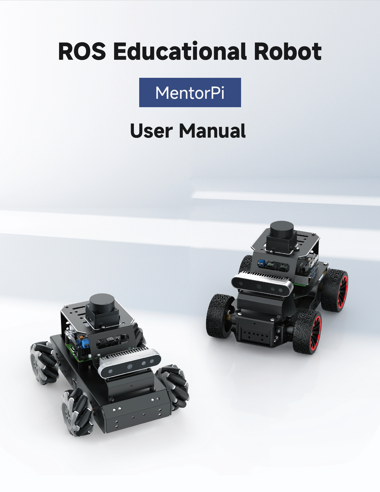
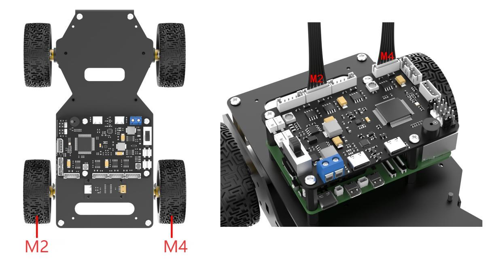
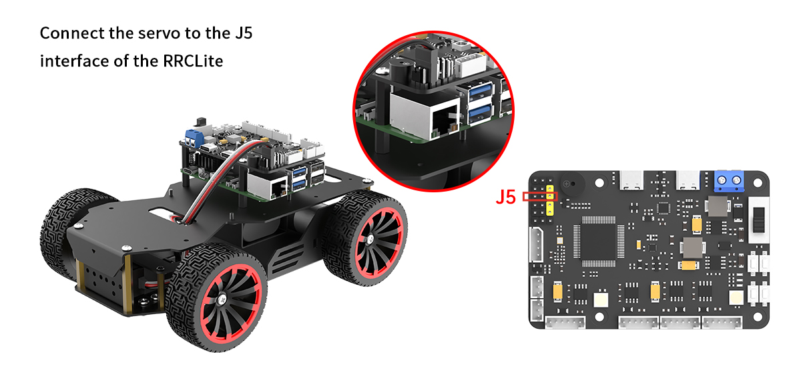

# 1. Getting Ready

## 1.1 MentorPi Introduction

**1.1.1 Product Introduction**

MentorPi is a ROS2 robot powered by the Raspberry Pi 5. It comes in two variants: MentorPi-M1, which features a Mecanum-wheel chassis, and MentorPi-A1, equipped with an Ackermann chassis. Both models are built with high-performance hardware, including a TOF Lidar and a 3D depth camera, enabling advanced functionalities such as mapping, navigation, path planning, image recognition, vision tracking, and human-robot interaction.

**1.1.2 Usage Precautions**

Please pay attention to the following points when using and storing this product:

(1) This product contains conductive components. Avoid contact with metal objects when powered on.

(2) After the robot is powered on, do not forcibly move the servo, as this may cause damage.

(3) If the robot runs for an extended period, the servos may become hot. Allow the robot to "**rest**" and wait for the servos to cool before resuming operation.

(4) Keep your face, glasses, and other body parts away from the robot while it is operating. Do not place fingers within the joint movement range to prevent injury. Also, be cautious of falls from high edges.

(5) The robot's servos are precision components and consumable parts. They may need replacement after long-term or intensive use.

(6) If the product will not be used for an extended period, fully charge the battery, remove it, and store it in a cool, dry place.

**1.1.3 Copyright Notice**

This manual is the property of Shenzhen Hiwonder Technology Co., Ltd. No organization or individual is permitted to reproduce, copy, translate, or distribute any content from this manual without authorization. Any unauthorized use or infringement of this manual's copyright will be subject to legal action by our company.

**1.1.4 Disclaimer**

The product described in this manual (including hardware, software, etc.) is provided "**as is**". Every effort has been made to ensure the accuracy of this manual, but we cannot guarantee it is completely free from errors or omissions. This document is regularly reviewed, and we welcome feedback for improvements. Product features and specifications may change with version upgrades. For the latest product information, please contact customer service when placing your order. Furthermore, unless explicitly stated by Hiwonder, we are not responsible for any losses resulting from product malfunctions or damage under extreme conditions outside of typical use cases.

## 1.2 Packing List

**(1) MentorPi M1 (Monocular camera version)**

<table border="1" class="docutils-nobg" style="text-align: center;">
<thead>
<tr>
<th><strong>No.</strong></th>
<th >Components</th>
<th><strong>Quantity</strong></th>
<th><strong>Picture</strong></th>
</tr>
</thead>
<tbody>
<tr>
<td>1</td>
<td>M1 (Mecanum) Chassis (Assembled; Battery included)</td>
<td>1</td>
<td></td>
</tr>
<tr>
<td>2</td>
<td>Controller top cover</td>
<td>1</td>
<td></td>
</tr>
<tr>
<td>3</td>
<td>Front cover</td>
<td>1</td>
<td></td>
</tr>
<tr>
<td>4</td>
<td>Rear cover</td>
<td>1</td>
<td></td>
</tr>
<tr>
<td>5</td>
<td>Raspberry Pi 5 (optional)</td>
<td>1</td>
<td></td>
</tr>
<tr>
<td>6</td>
<td>RRC Lite controller</td>
<td>1</td>
<td></td>
</tr>
<tr>
<td>7</td>
<td>Cooling fan</td>
<td>1</td>
<td></td>
</tr>
<tr>
<td>8</td>
<td>Raspberry Pi power supply cable</td>
<td>1</td>
<td></td>
</tr>
<tr>
<td>9</td>
<td>RRC data cable</td>
<td>1</td>
<td></td>
</tr>
<tr>
<td>10</td>
<td>64GB SD card (optional)</td>
<td>1</td>
<td></td>
</tr>
<tr>
<td>11</td>
<td>Card reader</td>
<td>1</td>
<td></td>
</tr>
<tr>
<td>12</td>
<td>Battery cable</td>
<td>1</td>
<td></td>
</tr>
<tr>
<td>13</td>
<td>Lidar</td>
<td>1</td>
<td></td>
</tr>
<tr>
<td>14</td>
<td>4PIN Lidar wire</td>
<td style="text-align: center;">1</td>
<td></td>
</tr>
<tr>
<td>15</td>
<td>Lidar data cable</td>
<td>1</td>
<td></td>
</tr>
<tr>
<td>16</td>
<td>8.4V 2A charger (DC5.5 * 2.5 male connector)</td>
<td>1</td>
<td></td>
</tr>
<tr>
<td>17</td>
<td>Monocular camera</td>
<td>1</td>
<td></td>
</tr>
<tr>
<td>18</td>
<td>Wireless handle and Handle receiver</td>
<td>1</td>
<td></td>
</tr>
<tr>
<td>19</td>
<td>EVA ball</td>
<td>1</td>
<td></td>
</tr>
<tr>
<td>20</td>
<td>Accessory bag (M2.5 * 20 Double-pass nylon column <em>6 M3 </em>6 Black round head screw * 14 M2 <em>6 Round head screw * 4 M2.5 </em>6 Round head screw * 10 M2.5 * 10+6 Single-pass nylon column * 1)</td>
<td>1</td>
<td></td>
</tr>
<tr>
<td>21</td>
<td>User manual</td>
<td>1</td>
<td></td>
</tr>
</tbody>
</table>

**(2) MentorPi M1 (Depth camera version)**

<table border="1" class="docutils-nobg" style="text-align: center;">
<thead>
<tr>
<th><strong>No.</strong></th>
<th>Components</th>
<th><strong>Quantity</strong></th>
<th><strong>Picture</strong></th>
</tr>
</thead>
<tbody>
<tr>
<td>1</td>
<td>M1 (Mecanum) Chassis (Assembled; Battery included)</td>
<td>1</td>
<td></td>
</tr>
<tr>
<td>2</td>
<td>Controller top cover</td>
<td>1</td>
<td></td>
</tr>
<tr>
<td>3</td>
<td>Front cover</td>
<td>1</td>
<td></td>
</tr>
<tr>
<td>4</td>
<td>Rear cover</td>
<td>1</td>
<td></td>
</tr>
<tr>
<td>5</td>
<td>Raspberry Pi 5 (optional)</td>
<td>1</td>
<td></td>
</tr>
<tr>
<td>6</td>
<td>RRC Lite controller</td>
<td>1</td>
<td></td>
</tr>
<tr>
<td>7</td>
<td>Cooling fan</td>
<td>1</td>
<td></td>
</tr>
<tr>
<td>8</td>
<td>Raspberry Pi power supply cable</td>
<td>1</td>
<td></td>
</tr>
<tr>
<td>9</td>
<td>RRC data cable</td>
<td>1</td>
<td></td>
</tr>
<tr>
<td>10</td>
<td>64GB SD card (optional)</td>
<td>1</td>
<td></td>
</tr>
<tr>
<td>11</td>
<td>Card reader</td>
<td>1</td>
<td></td>
</tr>
<tr>
<td>12</td>
<td>Battery cable</td>
<td>1</td>
<td></td>
</tr>
<tr>
<td>13</td>
<td>Lidar</td>
<td>1</td>
<td></td>
</tr>
<tr>
<td>14</td>
<td>4PIN Lidar wire</td>
<td>1</td>
<td></td>
</tr>
<tr>
<td>15</td>
<td>Lidar data cable</td>
<td>1</td>
<td></td>
</tr>
<tr>
<td>16</td>
<td>8.4V 2A charger  (DC5.5 * 2.5 male connector)</td>
<td>1</td>
<td></td>
</tr>
<tr>
<td>17</td>
<td>Depth camera</td>
<td>1</td>
<td></td>
</tr>
<tr>
<td>18</td>
<td>Wireless handle and Handle receiver</td>
<td>1</td>
<td></td>
</tr>
<tr>
<td>19</td>
<td>EVA ball</td>
<td>1</td>
<td></td>
</tr>
<tr>
<td>20</td>
<td>Accessory bag (M2.5 * 20 Double-pass nylon column <em>6 M3 </em>6 Black round head screw * 14 M2 <em>6 Round head screw * 4 M2.5 </em>6 Round head screw * 10 M2.5 * 10+6 Single-pass nylon column * 1)</td>
<td>1</td>
<td></td>
</tr>
<tr>
<td>21</td>
<td>User manual</td>
<td>1</td>
<td></td>
</tr>
</tbody>
</table>

**(3) MentorPi A1 Packing List(Monocular Camera Version)**

<table border="1" class="docutils-nobg" style="text-align: center;">
<thead>
<tr>
<th><strong>No.</strong></th>
<th>Components</th>
<th><strong>Quantity</strong></th>
<th><strong>Picture</strong></th>
</tr>
</thead>
<tbody>
<tr>
<td>1</td>
<td>A1 (Ackerman) Chassis (Assembled; Battery included)</td>
<td>1</td>
<td></td>
</tr>
<tr>
<td>2</td>
<td>Controller top cover</td>
<td>1</td>
<td></td>
</tr>
<tr>
<td>3</td>
<td>Front cover</td>
<td>1</td>
<td></td>
</tr>
<tr>
<td>4</td>
<td>Rear cover</td>
<td>1</td>
<td></td>
</tr>
<tr>
<td>5</td>
<td>Raspberry Pi 5 (optional)</td>
<td>1</td>
<td></td>
</tr>
<tr>
<td>6</td>
<td>RRC Lite controller</td>
<td>1</td>
<td></td>
</tr>
<tr>
<td>7</td>
<td>Cooling fan</td>
<td>1</td>
<td></td>
</tr>
<tr>
<td>8</td>
<td>Raspberry Pi power supply cable</td>
<td>1</td>
<td></td>
</tr>
<tr>
<td>9</td>
<td>RRC data cable</td>
<td>1</td>
<td></td>
</tr>
<tr>
<td>10</td>
<td>64GB SD card (optional)</td>
<td>1</td>
<td></td>
</tr>
<tr>
<td>11</td>
<td>Card reader</td>
<td>1</td>
<td></td>
</tr>
<tr>
<td>12</td>
<td>Battery cable</td>
<td>1</td>
<td></td>
</tr>
<tr>
<td>13</td>
<td>Lidar</td>
<td>1</td>
<td></td>
</tr>
<tr>
<td>14</td>
<td>4PIN Lidar wire</td>
<td>1</td>
<td></td>
</tr>
<tr>
<td>15</td>
<td>Lidar data cable</td>
<td>1</td>
<td></td>
</tr>
<tr>
<td>16</td>
<td>8.4V 2A charger (DC5.5 * 2.5 male connector)</td>
<td>1</td>
<td></td>
</tr>
<tr>
<td>17</td>
<td>Monocular camera</td>
<td>1</td>
<td></td>
</tr>
<tr>
<td>18</td>
<td>Wireless handle and Handle receiver</td>
<td>1</td>
<td></td>
</tr>
<tr>
<td>19</td>
<td>EVA ball</td>
<td>1</td>
<td></td>
</tr>
<tr>
<td>20</td>
<td>Accessory bag (M2.5 * 20 Double-pass nylon column <em>6 M3 </em>6 Black round head screw * 14 M2 <em>6 Round head screw * 4 M2.5 </em>6 Round head screw * 10 M2.5 * 10+6 Single-pass nylon column * 1)</td>
<td>1</td>
<td></td>
</tr>
<tr>
<td>21</td>
<td>User manual</td>
<td>1</td>
<td></td>
</tr>
</tbody>
</table>

**(4) MentorPi A1 Packing List(Depth camera Version)**

<table border="1" class="docutils-nobg" style="text-align: center;">
<thead>
<tr>
<th><strong>No.</strong></th>
<th>Components</th>
<th><strong>Quantity</strong></th>
<th><strong>Picture</strong></th>
</tr>
</thead>
<tbody>
<tr>
<td>1</td>
<td>A1 (Ackerman) Chassis (Assembled; Battery included)</td>
<td>1</td>
<td></td>
</tr>
<tr>
<td>2</td>
<td>Controller top cover</td>
<td>1</td>
<td></td>
</tr>
<tr>
<td>3</td>
<td>Front cover</td>
<td>1</td>
<td></td>
</tr>
<tr>
<td>4</td>
<td>Rear cover</td>
<td>1</td>
<td></td>
</tr>
<tr>
<td>5</td>
<td>Raspberry Pi 5 (optional)</td>
<td>1</td>
<td></td>
</tr>
<tr>
<td>6</td>
<td>RRC Lite controller</td>
<td>1</td>
<td></td>
</tr>
<tr>
<td>7</td>
<td>Cooling fan</td>
<td>1</td>
<td></td>
</tr>
<tr>
<td>8</td>
<td>Raspberry Pi power supply cable</td>
<td>1</td>
<td></td>
</tr>
<tr>
<td>9</td>
<td>RRC data cable</td>
<td>1</td>
<td></td>
</tr>
<tr>
<td>10</td>
<td>64GB SD card (optional)</td>
<td>1</td>
<td></td>
</tr>
<tr>
<td>11</td>
<td>Card reader</td>
<td>1</td>
<td></td>
</tr>
<tr>
<td>12</td>
<td>Battery cable</td>
<td>1</td>
<td></td>
</tr>
<tr>
<td>13</td>
<td>Lidar</td>
<td>1</td>
<td></td>
</tr>
<tr>
<td>14</td>
<td>4PIN Lidar wire</td>
<td>1</td>
<td></td>
</tr>
<tr>
<td>15</td>
<td>Lidar data cable</td>
<td>1</td>
<td></td>
</tr>
<tr>
<td>16</td>
<td>8.4V 2A charger (DC5.5 * 2.5 male connector)</td>
<td>1</td>
<td></td>
</tr>
<tr>
<td>17</td>
<td>Depth camera</td>
<td>1</td>
<td></td>
</tr>
<tr>
<td>18</td>
<td>Wireless handle and Handle receiver</td>
<td>1</td>
<td></td>
</tr>
<tr>
<td>19</td>
<td>EVA ball</td>
<td>1</td>
<td></td>
</tr>
<tr>
<td>20</td>
<td>Accessory bag (M2.5 * 20 Double-pass nylon column <em>6 M3 </em>6 Black round head screw * 14 M2 <em>6 Round head screw * 4 M2.5 </em>6 Round head screw * 10 M2.5 * 10+6 Single-pass nylon column * 1)</td>
<td>1</td>
<td></td>
</tr>
<tr>
<td>21</td>
<td>User manual</td>
<td>1</td>
<td></td>
</tr>
</tbody>
</table>

## 1.3 Charging & Usage Guide

**1.3.1 Charging Instruction**

For delivery safety, the LiPo battery is not fully charged. Please fully charge the battery before the first operation. To do so, connect the battery to the battery connector before the first charge. The charging time is approximately one hour.

**1.3.2 Charging Method**

Charging steps are as follows:

(1) Switch the robot to **"OFF"**.

(2) Connect the battery connectors with red-to-red, and black-to-black method.

Diagram of battery connector location for Mecanum wheel chassis

Diagram of battery connector location for Ackerman wheel chassis

(3) Take out the lithium battery DC plug from the side or bottom of the device. Insert the charger head in for charging.

Charging port location diagram for Mecanum wheel chassis

Charging port location diagram for Ackerman wheel chassis

(4) Check the charging status by the indicator on the charger. Red indicates charging, and green means the battery is fully charged.

Note: Please unplug the charger in time after charging is complete to avoid overcharging the battery.

**1.3.3 Battery Usage Guideline**

(1) Please charge the battery with the provided charger when its voltage drops below 6.4V. This ensures the stability of the robot's operation.

(2) If the robot is expected to be unused for a long time, please fully charge the battery. Switch the expansion board to "**OFF**". Disconnect the battery wires.

(3) The battery should be stored in a cool and dry environment to avoid shortening the battery life due to overheating or moisture.

(4) Do not hit, throw or step on the battery.

(5) Do not use the battery in an environment with strong electrostatic or magnetic fields. Otherwise, the safety protection device of the battery may be damaged.

:::{Note}
please strictly follow the guide. Our company is not responsible for any product damage, economic losses and accident caused by improper use.
:::

**1.3.4 Note for Device Usage**

(1) Do not place the robot on the edge of a high platform to avoid damage caused by the robot falling from a height. When using, place the robot on a flat surface.

(2) When driving forward, the robot may obviously deviate to one side and cannot move in a straight line. Please refer to the "**[3. Motion Control Lesson/ 3.3 IMU, Linear Velocity, and Angular Velocity Calibration](https://docs.hiwonder.com/projects/MentorPi/en/latest/docs/4.motion_control_lesson.html#imu-linear-velocity-and-angular-velocity-calibration)**" for calibration. Calibration is only to reduce deviation. The actual hardware deviation will always exist. Therefore, adjust it to relatively accurate status based on your own needs.

(3) Before starting up, please confirm that the USB handle receiver has been inserted properly. The handle receiver has already been inserted into the robot before delivery.

(4) Due to the intercommunication feature of the handle control, it is recommended not to use this function when multiple robots are in the same area. This avoids misconnection and control errors.

(5) If it is an Ackerman chassis version, the "**Lidar Guarding**" function is not supported.

(6) When mapping during startup, it is best for the robot to face a straight wall or a closed cardboard box instead to allow the Lidar to scan more points.

(7) Ensure the integrity of the map. In the area where the robot may move, all 360° areas around it need to be explored by the Lidar to increase the integrity of the map.

(8) In some large environments, it is best to let the robot complete the mapping, and then go to scan the various small details of the environment.

## 1.4 Robot Assembly & Wiring

Step1:

Step2:

Step3:

Step4:

Step5:

**If your purchase is equipped with the Ackermann-steering configuration, please adhere to the following wiring protocol for implementation**

Step1:

Step2:

Step3:

Step4:

**If the camera module included with your MentorPi system is a monocular type, please consult the following installation procedures for implementation.**

Step1:

Step2:

Step3:

Post installation:

## 1.5 Get Started

Switch the expansion board on, and wait for about 1 minute. The LED1 on the expansion board will turn blue. When the buzzer sounds a beep, it indicates that the ROS configuration is completed and the robot has started up.

After the robot is powered on, LED2 will flash once every second. A hotspot starting with "**HW**" will simultaneously be generated. The network configuration is the AP direct connection mode by default. Enter the password "**hiwonder**" to connect to the app or remote desktop tool.

Follow the table below to check the robot:

<table class="docutils" border="1">
<colgroup>
<col style="width: 33%" />
<col style="width: 33%" />
<col style="width: 33%" />
</colgroup>
<tbody>
<tr>
<td><strong>Module</strong></td>
<td><strong>Check Steps</strong></td>
<td><strong>Outcome</strong></td>
</tr>
<tr>
<td>LED on the expansion board</td>
<td>Observe the status of the LED</td>
<td>Default AP direct connection mode: LED1 is steady on; LED2 flashes once every second.</td>
</tr>
<tr>
<td>Buzzer</td>
<td>Check the beep sound</td>
<td>If the buzzer sounds a beep, the onboard hardware of the expansion board is normal.</td>
</tr>
<tr>
<td>Lidar</td>
<td>Observe the rotation</td>
<td>After a few seconds of powering on, the Lidar starts to rotate.</td>
</tr>
<tr>
<td>Depth camera/monocular camera</td>
<td>
Open the app and connect to the robot;

Open the "**Robot Control**" interface to view the live camera feed;

Drag the screen to adjust the angle of the camera pan-tilt. This feature is only available for the 2D pan-tilt version.
</td>
<td>Display the live camera feed and rotate the pan-tilt camera.</td>
</tr>
<tr>
<td>Encoder motor + STM32 controller</td>
<td>After power-on, use the handle/app "**Robot Control**" function to operate the robot.</td>
<td>The robot moves normally.</td>
</tr>
</tbody>
</table>

:::{Note}

* If the buzzer does not sound a beep, the hardware such as the IMU or buzzer may be abnormal. This usually does not happen under normal use. If such a problem occurs, please contact with our support team at support@hiwonder.com.

* If the device hotspot cannot be found, please check whether LED1 on the expansion board is steady on and whether LED2 flashes once every second.

:::

## 1.6 APP Control

**1.6.1 APP Installation and Connection**

You can use the **"WonderPi"** app to control MentorPi. Let's learn how to install and connect the app.

:::{Note}

Please grant all permissions to the app when installing. It ensures the app's normal use.
Before opening the app, make sure to enable the GPS and Wi-Fi function on your phone.

:::

* **APP Installation** 

**Android users:** Please locate the app install package under the same directory and then transfer it to your smart phone to install.

**iOS users:** Please search **"WonderPi"** in the **"APP Store"** to download and install.

* **Connection Mode** 

After installing the app, connect the robot. Here are two network modes for the robot:

① AP direct connection mode: the development board can turn on the hotspot to connect with the phone, but it cannot connect to an external network.

② STA LAN mode: the development board can actively connect to a designated hotspot or Wi-Fi, enabling communication with external networks.

The robot is the AP direct connection mode by default. No matter which mode is selected, you can achieve the same game functions of the MentorPi app.

It is recommended to learn the AP direct connection mode to experience the corresponding functions first. The LAN mode can be viewed based on your own needs.

**(1) Direct Connection Mode (Must Read)**

The mecanum wheel version on the Android system is used for demonstration. The operation is also applicable to iOS system.

① After opening the app **"WonderPi"**, select **"Advanced/MentorPi-M1"** in the home interface.

:::{Note}

The Ackerman chassis version should select "**MentorPi-A1**".

:::

② Click the "**+**" button at the lower right corner to select direct connection mode.

:::{Note}
If you use the LAN mode, please refer to " [**Connection Mode -> (2) LAN Mode Connection**](#2-lan-mode-connection)".
:::

③ Click **"Go to connect device hotspots"** to access the setting page, and connect to the hotspot generated by MentorPi.

④ When connecting, please enter the password **"hiwonder"**.

:::{Note}
If you are iOS user, when connecting to the hotspot, please wait until the prompt **"connect Wi-Fi successfully"** appears and then return to app. Otherwise, the device may not be searched. In this case, you can click  to refresh multiple times to search the device.
:::

⑤ Having connected, back to the APP. Then the phone will connect to the device automatically. Wait for a while, when the below robotic arm icon appears, it means that the device is connected successfully.

:::{Note}
If the prompt window **"network unavailable, continue or not"** pops up, click **"Keep Connection"** to proceed.
:::

⑥ If the prompt "Whether to switch and enter the searched product interface?" appears, it means that the product version selection was incorrect (**step ①**. Click the "**OK**" button to switch directly to the correct version mode selection interface.

⑦ The game mode selection interface is as below:

For specific operation method for each game, please refer to "[**1.6.2 APP Games Introduction**](#anchor_1_6_2)".

**(2) LAN Mode Connection**

① Connect your phone to the 5G network. Take connecting to the **"Hiwonder_5G"** Wi-Fi as an example. For routers that support dual-band, if they are set up separately, the Wi-Fi names are usually distinguished. For example, "**Hiwonder**" is for the 2.4G band, and "**Hiwonder_5G**" is for the 5G band.

② After opening the app **"WonderPi"**, select **"Advanced/MentorPi-M1"** in the home interface.

:::{Note}
The Ackerman chassis version should select "**MentorPi-A1**".
:::

③ Click the **"+"** button at the lower right corner to select LAN mode.

④ The app will prompt you to enter the password for the Wi-Fi you are connecting to. Please ensure that the password is entered correctly, as an incorrect password will result in a connection failure. After entering the password, click "**OK**".

⑤ Click **"Go to connect device hotspots"**.

⑥ Your phone will automatically switch to the Wi-Fi connection page. Locate the hotspot starting with "**HW**" and enter the password "**hiwonder**" to connect to it. After connecting, click "**Return**".

⑦ After the connection is complete, the app will start automatically configuring the network.

⑧ After a while, the main interface will display the MentorPi icon, and the LED light on the expansion board will also remain on.

⑨ Long press the MentorPi icon in the app to view the IP address and ID assigned to MentorPi.

⑩ You can search for its IP address on the remote desktop tool and establish a connection. For specific connection method, please access the "[**2. Set Development Environment**](https://docs.hiwonder.com/projects/MentorPi/en/latest/docs/3.set_development_environment.html)".  

⑪ To switch from LAN mode back to direct connection mode, press and hold the KEY1 button on the expansion board until the blue light flashes, indicating that the switch is complete.

**1.6.2 APP Games Introduction**

In this section, let's use the iOS system for the demonstrate. The method is also applicable to the Android system.  
The app provides five game modes: robot control, Lidar, object tracking, line following, and gesture control.

The following table provides a brief description of each game mode:

|                             Icon                             |               Function                |
| :----------------------------------------------------------: | :-----------------------------------: |
|  | Robot control      |
|  | Lidar              |
|  | Object tracking    |
|  | Line following     |
|  | Finger recognition |

* **Robot Control**

Click the **"Robot Control"** on mode selection interface to enter the operation interface of the game. There are slight differences in the interfaces between the mecanum wheel and Ackermann wheel versions.

(1) The interface for the mecanum wheel version is shown in the figure below:

**① Left Buttons:** From top to bottom, these buttons control gravity sensing, forward and backward movement, and speed adjustment.

**② Center Display:** Shows the live camera feed. Dragging the screen adjusts the angle of the camera pan-tilt (this feature is only available for the 2D pan-tilt version).

**③ Right Buttons:** Control left and right turns.

**④ Top Menu Bar:** Contains icons for capturing screenshots , toggling the navigation bar , and switching to fullscreen mode  (typically used with a wireless handle).

(2) The interface for the Ackerman wheel version is shown in the figure below:

**① Left Buttons:** From top to bottom, these buttons control forward and backward movement, and speed adjustment.

**② Center Display:** Shows the live camera feed. Dragging the screen adjusts the angle of the camera pan-tilt (this feature is only available for the 2D pan-tilt version).

**③ Right Buttons:** Control left and right turns.

**④ Top Menu Bar:** Contains icons for capturing screenshots , toggling the navigation bar , and switching to fullscreen mode  (typically used with a wireless handle).

:::{Note}
In the monocular camera version, after adjusting the pan-tilt servo to the limit position by dragging the screen, there will be vibration feedback when sliding the screen again. Please do not continue to rotate, as the pan-tilt servo has limit protection.
:::

* **Lidar**

:::{Note}

* Place the robot in a spacious area to ensure it has enough room to move.

* The Ackermann chassis version does not support the Lidar Guarding function.

:::

**(1) Interface introduction:**

Click the **"**Lidar**"** on mode selection interface to enter the game interface. The "**Lidar**" game consists of three modes: obstacle avoidance, Lidar following, and Lidar guarding.

The interface is divided into two parts:  

① Left side: switch the games;  

② Right side: displays the live camera feed.

**(2) Function Description**

|                             Icon                             |               Function                |
| :----------------------------------------------------------: | :-----------------------------------: |
|  | Turn on/off the avoid obstacle game.  |
|  | Turn on/off the Lidar following game. |
|  | Turn on/off the Lidar guarding game.  |
|  |     Display the live camera feed.     |

**(3) Operation Steps**

**① Avoid Obstacle**

The robot will keep going forward. When detecting obstacle, it will turn automatically to avoid obstacle.

**② Lidar Following**

When detecting obstacle, it will adjust its posture to keep a certain distance from obstacle.

**③ Lidar Guarding**

The robot will adjust its body to face obstacle when detecting obstacle.

* **Object Tracking**

:::{Note}
* For optimal tracking performance, it is recommended to slightly lower the camera and move the object on the ground, so that the robot can chase it more effectively.
* Set the color pickup range carefully—neither too broad nor too narrow. If the range is too broad, it may capture colors outside the target. If it's too narrow, it may fail to detect the target. Also, make sure there are no objects with colors similar to the target within the camera's field of view.
:::

**(1) Interface Introduction**

Click the "**Object Tracking**" on mode selection interface to enter the game interface. The interface consists of two parts:

① Left side: contains the game switch and color picking area;  

② Right side: displays the live camera feed.

**(2) Function Description**

|                             Icon                             |                           Function                           |
| :----------------------------------------------------------: | :----------------------------------------------------------: |
|  |                    Turn on/off the game.                     |
|  | Adjust the color threshold range, with a value range of 0.05 to 1.00. |
|  | Pick the color of the specified area within the live camera feed. |
|  | After clicking the "**Pick**" button, the button will switch to the "**OK**" button. This is used to confirm the selected color. |
|  |                 Display the selected color.                  |
|  |                Display the live camera feed.                 |

**(3) Operation Steps**

① After clicking the "**Pick**" button, drag red circle on live camera feed to the target to pick color.

② After tapping "**OK**" button, the color you pick will display at the right box.

③ Tap "**Start**" button. Then move the target object, and robot will move with it.

* **Line Following**

:::{Note}
Paste tape on the ground to set a path.

Set the color pickup range carefully—neither too broad nor too narrow. If the range is too broad, it may capture colors outside the target. If it's too narrow, it may fail to detect the target.

Also, make sure there are no objects with colors similar to the target within the camera's field of view.
:::

**(1) Interface Introduction**

Click the **"Line Following"** on mode selection interface to enter the game interface. The interface consists of two parts:

**① Left side:** contains the game switch and color picking area;  

**② Right side:** displays the live camera feed.

**(2) Function Description**

|                             Icon                             |                           Function                           |
| :----------------------------------------------------------: | :----------------------------------------------------------: |
|  |                    Turn on/off the game.                     |
|  | Adjust the color threshold range, with a value range of 0.05 to 1.00. |
|  | Pick the color of the specified area within the live camera feed. |
|  | After clicking the "**Pick**" button, the button will switch to the "**OK**" button. This is used to confirm the selected color. |
|  |                 Display the selected color.                  |
|  |                Display the live camera feed.                 |

**(3) Operation Steps**

① Tap to enter the game interface. Take red path as example. Click "**Pick**" button. Drag red circle on live camera feed to the path to pick color, then click **"OK"** button.

② The color you pick will display on the right box.

③ Turn on **"Start"** button, then robot will move along the path.

* **Gesture Control**

:::{Note}

* This mode only works with your right hand.

* For proper recognition, your entire palm must be visible on the screen.

*  Move your hand slowly.

:::

**(1) Interface Introduction**

Click the **"Gesture Control"** on mode selection interface to enter the game interface. The interface consists of two parts:

**① Left side:** contains the game switch and operation instructions;  

**② Right side:** displays the live camera feed.

**(2) Function Description**

|                             Icon                             |                           Function                           |
| :----------------------------------------------------------: | :----------------------------------------------------------: |
|  |            Turn on/off the gesture control game.             |
|  | Display the real-time camera feed. When the palm is opened and the palm is facing right, draw a trajectory. When the fist is clenched, the robot turns right. Draw a trajectory for forward, backward, left, and right movements, and the robot will respond accordingly by moving forward, backward, turning left, or turning right. |

**(3) Operation Steps**

① Clench your hand and hold it up to the center of the camera's field of view. Open your fingers and start moving your hand to draw a trajectory when you hear a beep.

② Move your hand in one of the up, down, left, or right directions for a certain distance while keeping your hand open.

③ Make a fist. After a beep sound, the robot will start moving in the direction of the trajectory.

