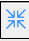
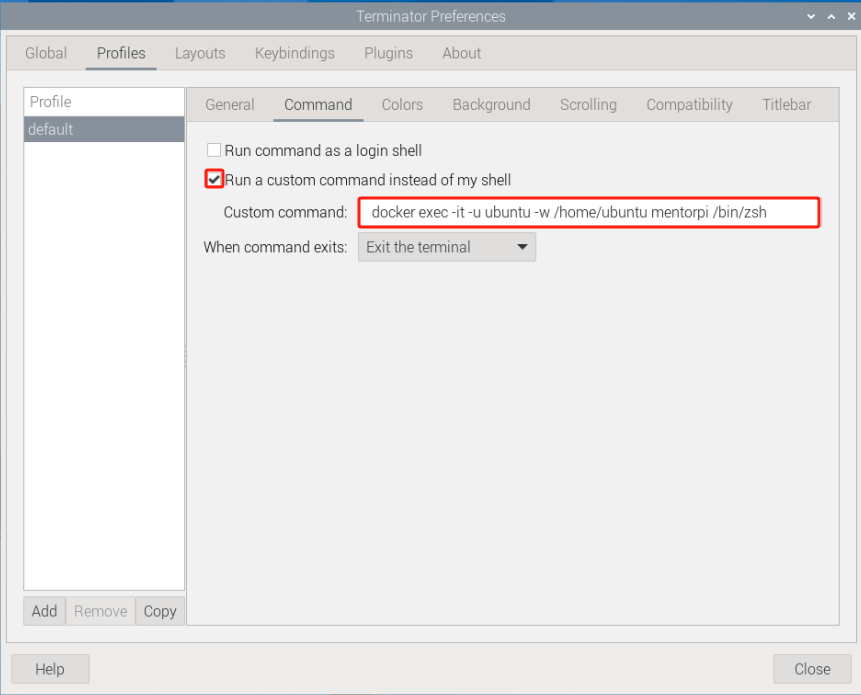

# 2. Set Development Environment

<p id="anchor_2_1"></p>

## 2.1 VNC Installation and Connection

### 2.1.1 Preparation

* **Hardware**

Prepare a computer. If you are using desktop computer, wireless network card is required.The network card should support 5G band.

* **Install VNC**

VNC is a graphical remote desktop control software. Through connecting your computer to the WiFi generated by Raspberry Pi, you can control Raspberry Pi. Installation of VNC is as below.

(1) Double-click the installation program **"VNC-Viewer-6.17.731-Windows"** in the same directory as this section. Select the installation language as "**English**" and lick "**OK**".


(2) Click "**Next**".


(3) Tick **"I accept the terms in the License Agreement"**. Then click **"Next"**.


(4) Remain default location where the software is installed. Click **"Next"** to proceed next interface. Then directly click **"Install"**.


(5) When the installation completes, click **"Finish"**.


(6) Click  to open VNC.

* **Start Robot**

Start Robot When LED1 on expansion board starts flickering and buzzer emits one beep, robot boots up successfully.

### 2.1.2 Connect to Robot

(1) After turning Robot on successfully, the default mode is AP direct connection mode. Robot generates a WiFi starting with HW. Connect your computer to this WiFi.


(2) Input password. The password is **"hiwonder"**.


(3) After connection, open VNC Viewer. Input the default IP address of Raspberry Pi, **192.168.149.1**, and then press Enter. If you receive security warning, select **"Continue"**.


(4) Input username and password. **(Username: pi  Password: raspberrypi)**. Click **"OK"** to enter Raspberry Pi desktop.


(5) The desktop is as pictured. If black screen occurs or only cursor leaves on the screen, restart Raspberry Pi.


### 2.1.3 Introduction to Desktop

The desktop is as pictured after connecting Robot through VNC successfully.


The following table demonstrates common functions:

<table  class="docutils-nobg" border="1" style="text-align:center;">
<colgroup>
<col  />
<col  />
</colgroup>
<tbody>
<tr>
<td >Icon</td>
<td >Function</td>
</tr>
<tr>
<td ></td>
<td ><p>Application menu. Click to select different applications.</p>
<p></p></td>
</tr>
<tr>
<td ></td>
<td >Browser.</td>
</tr>
<tr>
<td ></td>
<td >File manager.</td>
</tr>
<tr>
<td ></td>
<td >LX terminal. Click to input command line in the opened interface.</td>
</tr>
<tr>
<td ></td>
<td >Trash. You can find the files deleted here.</td>
</tr>
<tr>
<td ></td>
<td >PC software. You can adjust pan tilt and adjust color threshold on it.</td>
</tr>
<tr>
<td ></td>
<td >Full screen or exit full screen.。</td>
</tr>
<tr>
<td ></td>
<td >Exit full screen.</td>
</tr>
<tr>
<td ></td>
<td ><p>Shut down, reboot and logout</p>
<p></p></td>
</tr>
</tbody>
</table>

## 2.2 Robot Version Configuration Instruction

MentorPi comes with different chassis configurations (mecanum wheel or Ackermann) and camera versions. If you want to switch between different robot configurations or camera versions, follow these steps:

(1) Start the robot and connect it to the VNC. For more details about the connection, please refer to "[**2.1 VNC Installation and Connection**](#anchor_2_1)".

(2) In the remote desktop, double-click the robot system configuration tool . Then, click the "**Execute**" to execute it.


(3) In the camera type option of the interface, select the camera version needed, as shown in the red box in the following figure.


① "**ascamera**" represents the depth camera.

② "**usb_cam**" represents the two-dimensional pan-tilt monocular camera.

(4) In the robot type option of the interface, select the chassis type needed, as shown in the red box in the following figure.


① "**MentorPi_Mecanum**" represents the mecanum wheel chassis.

② "**MentorPi_Acker**" represents the Ackermann chassis.

(5) After the selection is completed, click "**Save > Apply > Exit**" in order. Only by clicking in this order can the robot type be successfully switched.


(6) Wait for the buzzer to sound a beep, indicating that the chassis type has been successfully switched. Then click  to view the ROS2 system environment.

## 2.3 System Introduction

### 2.3.1 Desktop Instruction

After remote connection via VNC, the Raspberry Pi system desktop is as shown in the figure below:


<div style="width: fit-content;margin:0 auto">

| **Icon**                                                     | **Function**                                                 |
| ------------------------------------------------------------ | ------------------------------------------------------------ |
|  | Version Switching Tool: switch between different versions and configurations of the robot car. |
|  | Color model parameter adjustment tool.                       |
|  | Command Line Terminal: input commands for operations.        |
|  | Recycle bin.                                                 |
|  | Raspberry Pi menu bar.                                       |
|  | System file folder.                                          |

</div>

### 2.3.2 Programming Instruction

The input command must be case sensitive and space, and the keyword supports "**TAB**" key to fill.

(1) Click  icon or press "**Ctrl+Alt+T**" to open LX terminal.

(2) Enter "**ls**" command and then press "**Enter**" to list all the documents. As shown in the figure below:


<div style="width: fit-content;margin:0 auto">

| **Directory** |      **Function**       |
| :-------------------------------------: | :-----------------------------------------------: |
|                MentorPi                 | Store the version debugging tool of the MentorPi. |
|            hiwonder-toolbox             |              Wi-Fi management tool.               |
|                 docker                  |       Folder shared with Docker container.        |

</div>


The function games and source codes of MentorPi are all stored in the Docker. Therefore, you need to enter the container to view them.

(3) Click  on the top left corner of the desktop to open the "**Terminator**".

(4) In the command line terminal, enter the command "**docker ps -a**". Press "**Enter**" to display the running and previously run containers. The "**container ID**" is the ID of the container; "**image**" is the name of the image used by the container; "**created**" is the time the container is created; "**status**" is the current status of the container.


(5) Based on the obtained container ID (unique), enter the command to enter the container with the function program.

```bash
docker exec -it -u ubuntu -w /home/ubuntu adb8 /bin/bash
```

:::{Note}

the container ID can be abbreviated as long as it is the unique identifier of the container.

:::

(6) Enter "**ls**" command. Press "**Enter**" to list all current files. Let's focus on these two directories shown below.


<div style="width: fit-content;margin:0 auto">

| **Directory** |                        **Function**                        |
| :-----------: | :--------------------------------------------------------: |
|    ros2_ws    |  The ROS workspace for storing MentorPi's function game.   |
|     share     |       The shared drive with the Raspberry Pi system.       |
|   softwave    | Store the PC software and color threshold adjustment tool. |

</div>

(7) Enter the command **"**cd ros2_ws/src/**"** to access the directory of the game and source code. Then, enter the command "**ls**" to list all folders and files under this directory.


| **Directory** |          **Function**           |
| :-----------: | :-----------------------------: |
|      app      | Store app game function package |
|    example    |            Game case            |
|    bringup    |    Reference to app function    |
|    driver     |       Underlying control        |
|  interfaces   |        Program interface        |
|  peripherals  |         Hardware driver         |
|  navigation   |           Navigation            |
|     slam      |             Mapping             |
|  yolov5_ros2  |           yolov5 game           |
|  simulations  |        urdf description         |

## 2.4 Docker Introduction & Usage

### 2.4.1 Docker Introduction

Docker is an open-source platform and tool. It enables you to package, publish, and run applications in containers. Containers are lightweight, standalone, executable software packages that contain the application's code, runtime, system tools, libraries, and settings. Docker allows developers to package applications along with their dependencies for quick and consistent deployment in different environments.

Technically, Docker uses containerization technology from the Linux operating system. This provides more efficient isolation between applications and enables multiple containers to run on the same physical machine. Each container is independent of the others.

In summary, Docker can be understood as a tool that makes applications and their dependencies more portable and easier to manage, bringing great convenience to software development and deployment.


<p style="text-align:center">Docker Logo</p>

For more details about Docker, please refer to the relevant tutorials access its websites:</span>

Docker Official Website: [http://www.docker.com](http://www.docker.com)

Docker Chinese Website: [https://www.docker-cn.com](https://www.docker-cn.com)

Docker Hub (Repository) Official Website: [https://hub.docker.com](https://hub.docker.com)

### 2.4.2 Docker Command

:::{Note}
These commands have been configured in the container before delivery.</span>
:::

All functions and programs of this robot are stored and executed within the Docker container. To help you quickly understand and operate this product, some commonly used Docker commands are introduced below.

(1) Turn on the device. Follow the instructions in "**[2.1 VNC Installation and Connection](#anchor_2_1)**" to connect to the computer via VNC.


(2) Click  in the upper left corner of the system desktop to open the Terminator.

The current terminal is for the Raspberry Pi system.

<p id="1_check_container"></p>

* **Check Container** 

Command parameters: docker ps \[OPTIONS\]

Commonly used parameters:

(1) -a：list all running and previously run containers

(2) -l：display the latest created container

(3) -n=?：display multiple (n) recently created containers

(4) -q：Default mode: only display container IDs

Enter "**docker ps -a**" in the command line terminal and press "**Enter**". The running and run containers are displayed. "**container id"** is the container ID. "**image**" is the image name used by the container. "**created**" is the creation time of the container. "**status**" is the current status of the container.


* **Enter Container** 

Obtain the unique container ID based on "[**2.4.2 Docker Command -> Check Container**](#1_check_container)". Enter the command to access the container that contains the function programs.

```bash
docker exec -it -u ubuntu -w /home/ubuntu adb8 /bin/bash
```

:::{Note}
The container ID can be abbreviated as long as it is the unique identify of the container.
:::

* **Exit Container** 

There are two commands for exiting containers:

(1) Enter "**exit**" directly in the terminal and press "**Enter**". This action will stop the container from running and exit it.


(2) Use "**crtl+P+Q**". The container exits directly but keeps running. You can enter the command `docker ps` in the terminal to view the running containers.


### 2.4.3 Convenient Tool Instruction (Must-Read)

Entering the container every time using the command in the Terminator is inconvenient. To simplify this process, you can set the command to enter the container in the terminator tool.

```bash
docker exec -it -u ubuntu -w /home/ubuntu adb8 /bin/bash
```

(1) Right-click on the terminator window and select "**Preferences**".


(2) Select **"**Profiles -> Command**"**.


(3) Check the box. Enter the command "**docker exec -it -u ubuntu -w /home/ubuntu mentorpi /bin/bash**" to enter the container.

:::{Note}
"**mentorpi**" is the name of the container that contains the function programs, or enter the container ID number)
:::



(4) Click "**Close**". Then, every time you open the terminal, you can directly enter the container that contains the function programs.

