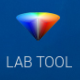
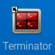
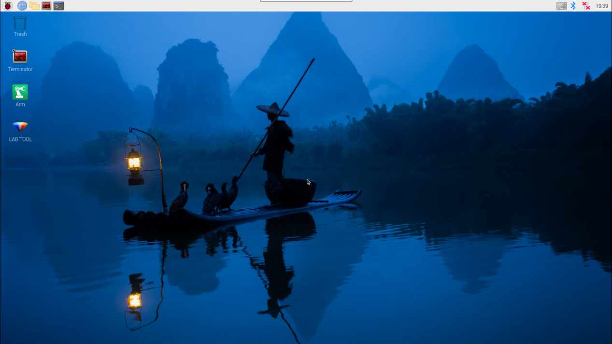

# 2. Set Development Environment

<p id="anchor_2_1"></p>

## 2.1 VNC Installation and Connection

### 2.1.1 Preparation

* **Hardware**

A laptop is required. If you're using a desktop computer, please ensure you have a wireless network adapter that supports the 5GHz frequency band.

* **Install VNC**

VNC is a graphical remote desktop control software. Through connecting your computer to the WiFi generated by Raspberry Pi, you can control Raspberry Pi. Installation of VNC is as below.

(1) Double-click the installation program [VNC-Viewer-6.17.731-Windows](resources_download.md) in the same directory as this section. Select the installation language as "**English**" and lick "**OK**".


(2) Click "**Next**" to proceed.


(3) In the License Agreement window, select **"I accept the terms in the License Agreement",** then click **"Next"**.


(4) Keep the default installation location and click **"Next".** When you are taken to the next screen, simply click **"Install".**


(5) Once the installation is complete, click **"Finish".**


(6) After the installation, double-click the VNC Viewer icon  to open the program and begin connecting.

* **Turn on Device**

After connecting the power adapter, please turn on the Raspberry Pi expansion board. The LED1 indicator will light up first, followed by a sound from the buzzer, indicating that the robot has successfully powered on.

### 2.1.2 Connect to Robot

(1) After turning on, it is the AP direct connection mode by default, and Raspberry Pi will launch a hotspot starting with "**HW**". Please search for and connect to this hotspot on your computer, as shown below:


(2) Input password. The password is **"hiwonder"**.


(3) Enter the default IP address of the Raspberry Pi 192.168.149.1 in the opened VNC Viewer, and then press **"Enter".** If the software warns that the connection is not safe, just click **"Continue"**.


(4)  Enter the password **"raspberrypi"** in the pop-up prompt box (if it requires you to enter an account name, use **"pi"**), then check the **"Remember password"** box, and then click **"OK"**. The Raspberry Pi's desktop will now display on your computer's monitor.


(5)  After entering the Raspberry Pi interface, a warning dialogue box will pop up (This is normal), click "**OK**" to close it (if a black screen occurs, please restart the Raspberry Pi).


### 2.1.3 Introduction to Desktop

After successfully connecting to the MentorPi via VNC, the operating interface will appear as shown below:


The following table provides an explanation of commonly used functions:

<table  class="docutils-nobg" border="1" style="text-align:center;">
<colgroup>
<col  />
<col  />
</colgroup>
<tbody>
<tr>
<td >Icon</td>
<td >Function</td>
</tr>
<tr>
<td ></td>
<td ><p>Application menu. Click to select different applications.</p>
<p></p></td>
</tr>
<tr>
<td ></td>
<td >Browser comes with the system.</td>
</tr>
<tr>
<td ></td>
<td >File manager.</td>
</tr>
<tr>
<td ></td>
<td >LX terminal. Click it to open a command line terminal for entering commands.</td>
</tr>
<tr>
<td ></td>
<td >Trash can allows you to recover recently deleted files.</td>
</tr>
<tr>
<td ></td>
<td >PC software allows you to adjust the the position of the pan-tilt and color threshold.</td>
</tr>
<tr>
<td ></td>
<td >Click it to enable or disable full-screen display of the desktop.</td>
</tr>
<tr>
<td ></td>
<td >Exit full-screen mode.</td>
</tr>
<tr>
<td ></td>
<td ><p>Power. Click it to shut down, restart, or log out of the system.</p>
<p></p></td>
</tr>
</tbody>
</table>

## 2.2 Robot Version Configuration Instruction

MentorPi offers multiple chassis options (Mecanum wheel or Ackermann steering) and different camera versions. If you need to switch between robot configurations or camera types, please follow the steps below:

(1) Start the robot and connect it to the VNC. For more details about the connection, please refer to "[**2.1 VNC Installation and Connection**](#anchor_2_1)".

(2) In the remote desktop, double-click the robot system configuration tool . Then, click the "**Execute**" to execute it.


(3) Select the appropriate camera type under the Camera Type dropdown:


① "**ascamera**" represents the 3D depth camera.

② "**usb_cam**" represents the 2D monocular camera.

(4) Select the correct chassis type under the Machine Type dropdown:


① "**MentorPi_Mecanum**" represents the mecanum wheel chassis.

② "**MentorPi_Acker**" represents the Ackermann chassis.

(5) Click the buttons in the following order: "**Save**" → "**Apply**" → "**Quit**". This sequence must be followed to successfully apply the new configuration.


(6) Wait for a beep sound from the buzzer, indicating that the chassis type has been successfully updated. Then, open the terminal   or related tool to check the ROS2 system environment.

## 2.3 System Introduction

### 2.3.1 Desktop Overview

After establishing a remote connection via VNC, the Raspberry Pi system desktop will appear as shown in the image below:


<div style="width: fit-content;margin:0 auto">

| **Icon**                                                     | **Function**                                                 |
| ------------------------------------------------------------ | ------------------------------------------------------------ |
|  | Version Switching Tool: switch between different versions and configurations of the robot car. |
|  | Color model parameter adjustment tool.                       |
|  | Command Line Terminal: input commands for operations.        |
|  | Recycle bin.                                                 |
|  | Raspberry Pi menu bar.                                       |
|  | System file folder.                                          |

</div>

### 2.3.2 Programming Instruction

:::{Note}

commands are case-sensitive and require correct spacing. You can use the TAB key to auto-complete keywords.

:::

(1) Click  icon or press "**Ctrl+Alt+T**" to launch the LX Terminal.

(2) Type the following command and press Enter:

```
ls
```


<div style="width: fit-content;margin:0 auto">

| **Directory** |      **Function**       |
| :-------------------------------------: | :-----------------------------------------------: |
|                MentorPi                 | Contains debugging tools specific to MentorPi |
|            hiwonder-toolbox             |              Wi-Fi management tool.               |
|                 docker                  | Shared folder between the Raspberry Pi system and the Docker container |

</div>


All function games and source code related to MentorPi are stored inside the Docker container. You must enter the container to access them.

(3) Click  on the top left corner of the desktop to open the "**Terminator**".

(4) In the terminal, enter the following command to view active and previously run containers:

```
docker ps -a
```


(5) Use the following command to access the container:

:::{Note}

Replace <container_id> with the actual container ID. It can be abbreviated as long as it remains unique.

:::

```bash
docker exec -it -u ubuntu -w /home/ubuntu adb8 /bin/bash（The container'sID can be abbreviated as long as it remains unique.）
```

:::{Note}

The container ID can be abbreviated as long as it is the unique identifier of the container.

:::

(6)  Enter the following command, and press "**Enter**" to list all current files. Let's focus on these two directories shown below.

```
ls
```


<div style="width: fit-content;margin:0 auto">

| **Directory** |                         **Function**                         |
| :-----------: | :----------------------------------------------------------: |
|    ros2_ws    |   The ROS workspace for storing MentorPi's function game.    |
|     share     | Shared directory between the Raspberry Pi and Docker container. |
|   softwave    | Contains PC-side software and color threshold adjustment tools |

</div>

(7) Enter the command **"**cd ros2_ws/src/**"** to access the directory of the game and source code. Then, enter the command "**ls**" to list all folders and files under this directory.

```
cd ros2_ws/src/
```

```
ls
```


| **Directory** |          **Function**           |
| :-----------: | :-----------------------------: |
|      app      | Store app game function package |
|    example    |            Game case            |
|    bringup    |    Reference to app function    |
|    driver     |       Underlying control        |
|  interfaces   |        Program interface        |
|  peripherals  |         Hardware driver         |
|  navigation   |           Navigation            |
|     slam      |             Mapping             |
|  yolov5_ros2  |           yolov5 game           |
|  simulations  |        urdf description         |

## 2.4 Docker Introduction & Usage

### 2.4.1 Docker Introduction

Docker is an open-source platform and tool. It enables you to package, publish, and run applications in containers. Containers are lightweight, standalone, executable software packages that contain the application's code, runtime, system tools, libraries, and settings. Docker allows developers to package applications along with their dependencies for quick and consistent deployment in different environments.

Technically, Docker uses containerization technology from the Linux operating system. This provides more efficient isolation between applications and enables multiple containers to run on the same physical machine. Each container is independent of the others.

In summary, Docker can be understood as a tool that makes applications and their dependencies more portable and easier to manage, bringing great convenience to software development and deployment.


<p style="text-align:center">Docker Logo</p>

For more details about Docker, please refer to the relevant tutorials access its websites:

Docker Official Website: [http://www.docker.com](http://www.docker.com)

Docker Chinese Website: [https://www.docker-cn.com](https://www.docker-cn.com)

Docker Hub (Repository) Official Website: [https://hub.docker.com](https://hub.docker.com)

### 2.4.2 Docker Command

:::{Note}
These commands have been configured in the container before delivery.
:::

All functions and programs of this robot are stored and executed within the Docker container. To help you quickly understand and operate this product, some commonly used Docker commands are introduced below.

(1) Turn on the device. Follow the instructions in "**[2.1 VNC Installation and Connection](#anchor_2_1)**" to connect to the computer via VNC.



(2) Click  in the upper left corner of the system desktop to open the Terminator.

The current terminal is for the Raspberry Pi system.

<p id="1_check_container"></p>

* **Check Container** 

Command parameters: docker ps \[OPTIONS\]

Commonly used parameters:

(1) -a：list all running and previously run containers

(2) -l：display the latest created container

(3) -n=?：display multiple (n) recently created containers

(4) -q：Default mode: only display container IDs

Enter the following command and press **"Enter"** to display a list of running and previously run containers. The output will show the **"container ID,"** which is the unique identifier for each container, the **"image"**, which indicates the name of the image used, the **"created"** time, which shows when the container was created, and the "**status**", which indicates the current state of the container.

```
docker ps -a
```


* **Enter Container** 

Obtain the unique container ID based on "[**2.4.2 Docker Command -> Check Container**](#1_check_container)". Enter the command to access the container that contains the function programs.

```bash
docker exec -it -u ubuntu -w /home/ubuntu adb8 /bin/bash (The container ID can be abbreviated as long as it remains unique to the container.)
```

:::{Note}
The container ID can be abbreviated as long as it is the unique identify of the container.
:::

* **Exit Container** 

There are two commands for exiting containers:

Method 1: Enter the command below and press **"Enter"**. This stops the container and exits it.

```
exit
```


Method 2: Use **"crtl+P+Q"**. This detaches from the container without stopping it. Then use docker ps to verify that it is still running:


## 2.5 MentorPi Servo Deviation Adjustment

### 2.5.1 Preface

If you purchased an Ackermann chassis or a monocular camera version, the system includes several PWM servos that serve as the core components for steering control. Due to assembly tolerances, you may encounter slight deviations—such as the vehicle veering slightly to one side—even after the servos are powered on and set to their neutral positions.  

This document provides step-by-step guidance to help you manually adjust the servo alignment and correct these deviations.

### 2.5.2 Operation Steps

(1) Start the robot and access the robot system using the remote control software VNC according to the instructions provided in [2.1 VNC Installation and Connection](#anchor_2_1).

(2) Execute the command below to disable the app auto-start service.

```
~/.stop_ros.sh
```

(3) Click-on  and input the following command to run the deviation adjustment script.

```
./Servo.sh
```

(4) After executing the command, a pop-up window will appear as shown below.


(5) Drag the four sliders shown below to adjust the corresponding servo offsets. The servos will rotate in real time during the adjustment, allowing you to observe their movement and fine-tune the deviation accordingly.


(6) If you're not satisfied with the adjustment results, click the **'Set Center Position'** button to reset all servo offsets to their default center positions and readjust as needed.


(7) After adjusting the servos to the desired positions, click the **'Save Offsets'** button to save the calibration settings.

Below is the storage path.


The following file will be saved:


After completing this step, the offset values will be stored. In all future applications involving the servos, this offset file will be automatically loaded to compensate for any servo deviations.

(8) You may also enter the following command and press Enter to launch the chassis control node and verify that the offset values have been applied correctly.

```
ros2 launch ros_robot_controller ros_robot_controller.launch.py
```

It can be confirmed that the offset values have been successfully saved to the file and can be correctly loaded in other applications.

