# 3. Motion Control Lesson

## 3.1 Mecanum Wheel Chassis Motion Analysis

### 3.1.1 Hardware Structure


The Mecanum wheel comprises rollers and an axle. The axle functions as the main support structure for the entire wheel, with rollers attached to it. The axle axis is positioned at a 45-degree angle to the roller axis. Typically, Mecanum wheels operate in groups of four, with two left wheels and two right wheels. Wheels A and B are symmetrical.

There are various combinations of four Mecanum wheels, such as AAAA, BBBB, AABB, ABAB, and BABA. However, not all combinations allow the robot car to move in all directions, including forward, backward, and sideways. The Mecanum-wheel chassis combination is ABAB, enabling omnidirectional movement.


### 3.1.2 Physical Characteristics

The vehicle achieves omnidirectional motion by summing up the propelling forces of the ground-engaging rollers. This summation can occur in any direction through adjustments in wheel rotation direction and torque magnitude for the four wheels.

Because of the rollers' specific orientation at a certain angle to the wheel circumference, Mecanum wheels have the ability to slip sideways. The generatrix of these small rollers is unique. As the Mecanum wheel rotates around its fixed axle, each small roller's envelope forms a cylindrical surface, allowing the wheel to continuously roll forward.

### 3.1.3 Motion Principle and Formula

When conducting kinematic analysis, we can consider the kinematic model of Mecanum wheels, which includes the following parameters:


(1) V<sub>x</sub>: Velocity of the Mecanum wheel in the X-axis (typically front and rear direction).

(2) V<sub>y</sub>: Velocity of the Mecanum wheel in the Y-axis (typically left and right direction).

(3) V<sub>ω</sub>:Angular velocity of the Mecanum wheel chassis (rotation speed of the chassis around its own center).

(4) Real-time velocities of the four wheels of the Mecanum wheel.

(5) The motion of the right front wheel in the plane can be decomposed into:

(6) VBx: Velocity of the Mecanum wheel in the X-axis (typically front and rear direction).

(7) VBy: Velocity of the Mecanum wheel in the Y-axis (typically left and right direction).

(8) L: Distance between the centers of the left and right wheels.

(9) H: Distance between the centers of the front and rear wheels.

(10) θ<sub>ω</sub>: Angle formed by the chassis body center and the center of the right front wheel, typically 45°.

(11) With these parameters, we can perform kinematic analysis of the Mecanum wheel chassis. The following are key mathematical formulas:

**Kinematics Formula:**

To simplify the mathematical model for kinematics, we make the following two idealized assumptions:

(1) Omni-directional wheels do not slip on the ground, and there is sufficient friction with the ground.

(2) The 4 wheels are distributed at the corners of a rectangle or square, with the wheels parallel to each other.

Here, we decompose the rigid body motion of the car into three components linearly. By calculating the velocities of the four wheels when the output Mecanum wheel chassis translates along the X+ and Y+ directions and rotates along the Z+ direction, we can combine these three simple motions using formulas to determine the required speeds of the four wheels.

In the equations, A, B, C, and D represent the rotational speeds of the four wheels, i.e., the motor speeds. VX is the translation speed of the car along the X-axis, VY is the translation speed along the Y-axis, and ω is the rotational speed along the Z-axis. L/2 is half of the car's wheelbase, and H/2 is half of the car's axle distance.

(1) The velocity components of each wheel during the robot's translation along the X-axis can be calculated using the following formulas:


Where,

V<sub>A</sub>,V<sub>B</sub>,V<sub>C</sub>,V<sub>D</sub>:Real-time velocities of the four Mecanum wheels，

V<sub>x</sub>:Velocity of the Mecanum wheel in the X-axis direction

(2) When the robot translates along the Y-axis, the speed component of each wheel can be calculated using the following formula:


Where, V<sub>y</sub> is the velocity of the robot in the Y-axis direction.

(3) When the robot rotates along the Z-axis, the speed component of each wheel can be calculated using the following formulas:


Where，:The angular velocity of the Mecanum wheel chassis (i.e., the speed at which the chassis rotates around its own center)

(4) Combining the velocities in the X, Y, and Z directions allows for the computation of the rotation speeds of the four wheels based on the motion state of the car.


### 3.1.4 Program Outcome

The program file is saved in: [ros2_ws/src/driver/controller/controller/mecanum.py](../_static/source_code/controller.zip)


Mecanum wheel kinematics class, used to calculate wheel speeds and implement Mecanum wheel kinematics.

(1) Init:

{lineno-start=11}

```python
    def __init__(self, wheelbase=0.1368, track_width=0.1410, wheel_diameter=0.065):
        self.wheelbase = wheelbase
        self.track_width = track_width
        self.wheel_diameter = wheel_diameter
```

Initialize the wheel dimensions for convenient subsequent calculations.

(2) speed_convert:

{lineno-start=16}

```python
    def speed_covert(self, speed):
        """
        covert speed m/s to rps/s
        :param speed:
        :return:
        """
        # distance / circumference = rotations per second
        return speed / (math.pi * self.wheel_diameter)
```

Convert m/s to rps/s based on the wheel's parameters.

(3) set_velocity:

{lineno-start=25}

```python
    def set_velocity(self, linear_x, linear_y, angular_z):
        """
        Use polar coordinates to control moving
                    x
        v1 motor1|  ↑  |motor3 v3
          +  y - |     |
        v2 motor2|     |motor4 v4
        :param speed: m/s
        :param direction: Moving direction 0~2pi, 1/2pi<--- ↑ ---> 3/2pi
        :param angular_rate:  The speed at which the chassis rotates rad/sec
        :param fake:
        :return:
        """
        # vx = speed * math.sin(direction)
        # vy = speed * math.cos(direction)
        # vp = angular_rate * (self.wheelbase + self.track_width) / 2
        # v1 = vx - vy - vp
        # v2 = vx + vy - vp
        # v3 = vx + vy + vp
        # v4 = vx - vy + vp
        # v_s = [self.speed_covert(v) for v in [v1, v2, -v3, -v4]]
        motor1 = (linear_x - linear_y - angular_z * (self.wheelbase + self.track_width) / 2)
        motor2 = (linear_x + linear_y - angular_z * (self.wheelbase + self.track_width) / 2)
        motor3 = (linear_x + linear_y + angular_z * (self.wheelbase + self.track_width) / 2)
        motor4 = (linear_x - linear_y + angular_z * (self.wheelbase + self.track_width) / 2)
        v_s = [self.speed_covert(v) for v in [-motor1, -motor2, motor3, motor4]]
        data = []
        for i in range(len(v_s)):
            msg = MotorState()
            msg.id = i + 1
            msg.rps = float(v_s[i])
            data.append(msg)
        
        msg = MotorsState()
        msg.data = data
        return msg
```

Based on the input speed parameters, decompose them, calculate the speeds using speed_convert, and then publish the calculated radian speeds to the motors.

## 3.2 Ackerman Chassis Motion Analysis

### 3.2.1 Hardware Structure

The transmission mechanism of the Ackermann chassis front wheels includes a servo, linkage, and wheels. The servo is linked to the linkage, and the linkage is connected to the wheels. The servo's rotation governs the extent of the linkage's rotation, thereby affecting the steering of the front wheels.

During a turn, the front two wheels are in a parallel state, with both wheels having the same angles of rotation. The control of the rear wheels is managed by the motor and wheels, where the motor's rotation determines the robot's forward, backward, and speed movements.


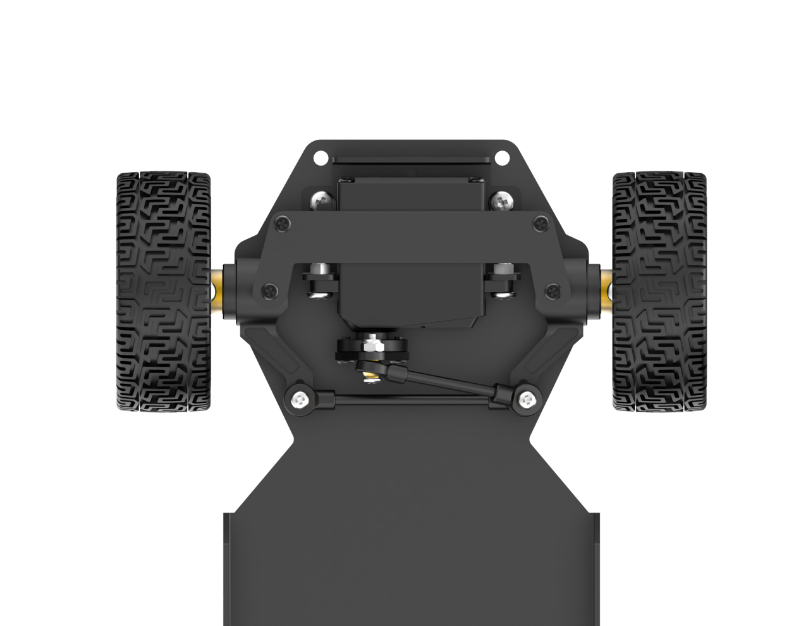

### 3.2.2 Physical Characteristics

The design objective of the Ackermann chassis is to provide excellent steering performance and stability. It employs a principle called "**Ackermann geometry**" to achieve this. Ackermann geometry refers to the difference in steering angles between the front and rear wheels. By allowing the inner front wheel to have a greater steering angle, the Ackermann chassis makes it easier to control the vehicle during turns and reduces the risk of sliding during steering.

Additionally, the Ackermann chassis features a well-designed suspension system. The suspension system is a crucial component connecting the wheels and the vehicle body, significantly influencing the physical characteristics of the chassis. Ackermann chassis typically adopts an independent suspension system, enabling the independent control of each wheel's movement. This design enhances suspension performance, improving vehicle stability and ride comfort.

Furthermore, the Ackermann chassis considers the position of the vehicle's center of gravity. The center of gravity's location has a significant impact on the vehicle's stability and handling performance. Generally, the Ackermann chassis places the center of gravity lower to reduce the risk of vehicle tilt and sliding.

Lastly, the physical characteristics of the Ackermann chassis include the braking system and power transmission system. The braking system influences the vehicle's braking performance and stability by controlling the braking force on the wheels. The power transmission system is responsible for transferring the engine's power to the wheels, affecting the vehicle's acceleration and driving performance.

### 3.2.3 Motion Principle and Formula

When conducting kinematic analysis of the Ackermann chassis, we can use the following mathematical formulas and parameters to describe its motion characteristics:

To achieve pure rolling motion for the Ackermann car (meaning no side slip during turns), it is necessary to ensure that the normals of the four wheels' motion directions (lines perpendicular to the direction of tire rolling) intersect at a single point, which is the center of rotation.

To simplify the model, let's assume that the front wheels have only one wheel (the theoretical concept remains consistent) located in the middle position of the front axle, as depicted by the dashed line in the diagram:


**(1) Front Wheel Steering Angle (θ):** The rotation angle of the front wheels, indicating the angle by which the front wheels deviate from the vehicle's forward direction. It is typically measured in radians (rad).

**(2) Vehicle Linear Velocity (V):** The overall linear speed of the vehicle, representing its translational velocity. It is usually measured in meters per second (m/s). The left rear wheel speed is denoted as (V<sub>L</sub>), and the right rear wheel speed is denoted as (V<sub>R</sub>).

**(3) Vehicle Track Width (D):** The distance between the wheels on the left and right sides of the vehicle, measured in meters (m).

**(4) Wheelbase of the Vehicle (H):** The distance between the front and rear wheels of the vehicle, measured in meters (m)

**(5) Vehicle Turning Radius (R):** The radius of the circle described by the vehicle during a turn, measured in meters (m). The turning radius for the left wheel is (R<sub>L</sub>), and for the right wheel is (R<sub>R</sub>).

Process for Calculating Robot Speed and Angle:

(6) Consistency of angular velocity:


In this context:

ω represents the angular velocity of the vehicle.

R denotes the turning radius of the vehicle.

V is the linear velocity of the vehicle.

V<sub>L</sub> is the linear velocity of the left rear wheel.

V<sub>R</sub> is the linear velocity of the right rear wheel.

R<sub>L</sub> is the turning radius of the left wheel.

R<sub>R</sub> is the turning radius of the right wheel.

(7) The relationship between the front wheel steering angle and the turning radius of the vehicle:


H represents the distance between the front and rear wheels of the vehicle.

R signifies the turning radius of the vehicle.

D denotes the distance between the wheels on the left and right sides of the vehicle.

θ indicates the steering angle of the front wheels.

(8) The speeds of the left and right wheels of the robot can be determined as:


(9) The speeds of the left and right wheels of the robot can be determined as:


By knowing the wheelbase, track width, robot speed, and the steering angle of the servo, it is possible to calculate the speeds of the two rear wheels of the robot.

### 3.2.4 Program Outcome

The program files are located in: [ros2_ws/src/driver/controller/controller/ackermann.py](../_static/source_code/controller.zip)

Ackermann wheel kinematics module, used to calculate wheel speeds and implement Ackermann wheel kinematics.

(1) Init:

{lineno-start=12}

```python
    def __init__(self, wheelbase=0.145, track_width=0.133, wheel_diameter=0.067):
        self.wheelbase = wheelbase
        self.track_width = track_width
        self.wheel_diameter = wheel_diameter
```

Initialize the wheel dimensions for easier subsequent calculations

(2) speed_covert:

{lineno-start=17}

```python
    def speed_covert(self, speed):
        """
        covert speed m/s to rps/s
        :param speed:
        :return:
        """
        return speed / (math.pi * self.wheel_diameter)
```

Convert m/s to rps/s based on the wheel parameters.

(3) set_velocity:

{lineno-start=25}

```python
    def set_velocity(self, linear_speed, angular_speed, reset_servo=True):
        servo_angle = 1500
        data = []
        if abs(linear_speed) >= 1e-8:
            if abs(angular_speed) >= 1e-8:
                theta = math.atan(self.wheelbase*angular_speed/linear_speed)
                steering_angle = theta
                # print(math.degrees(steering_angle))
                if abs(steering_angle) > math.radians(29):
                    steering_angle = math.radians(29)
                    # for i in range(4):
                        # msg = MotorState()
                        # msg.id = i + 1
                        # msg.rps = 0.0
                        # data.append(msg)
                    # msg = MotorsState()
                    # msg.data = data
                    # return None, msg
                servo_angle = 1500 + 2000*math.degrees(-steering_angle)/180
   

            vr = linear_speed + angular_speed*self.track_width/2
            vl = linear_speed - angular_speed*self.track_width/2
            v_s = [self.speed_covert(v) for v in [0, vl, 0, -vr]]
            for i in range(len(v_s)):
                msg = MotorState()
                msg.id = i + 1
                msg.rps = float(v_s[i])
                data.append(msg) 
            msg = MotorsState()
            msg.data = data
            return servo_angle, msg
                else:
            for i in range(4):
                msg = MotorState()
                msg.id = i + 1
                msg.rps = 0.0
                data.append(msg)
            msg = MotorsState()
            msg.data = data
            return None, msg
```

Based on the input speed parameters, decompose them, calculate the speeds using speed_convert, and then publish the calculated radian speeds to the motors. Calculate the required steering angle from the linear and angular velocities, convert it, and send it to the servos.

## 3.3 IMU, Linear Velocity and Angular Velocity Calibration

:::{Note}

* The robot has been calibrated before leaving the factory and does not require additional calibration. The information is provided for reference only. If you observe significant deviations during robot movement, such as noticeable drifting to one side when moving forward or an inability to travel straight, you can consult the following tutorial for calibration.

* Calibration aims to minimize deviations, but actual hardware variations are inherent. Hence, adjust the calibration to a level that reasonably suits your requirements.

:::

If the robot exhibits deviations during operation, it may require IMU, linear velocity and angular velocity calibration. Once the calibration process is completed, the robot can resume normal operation.

### 3.3.1 IMU Calibration

IMU (Inertial Measurement Unit) is a device that measures the three-axis attitude angles (angular velocity) and acceleration of an object. The gyroscope and accelerometer are the main components of the IMU, providing a total of 6 degrees of freedom to measure the angular velocity and acceleration of the object in three-dimensional space.


Upon receiving the first IMU message, the node will prompt you to maintain the IMU in a specific orientation and press Enter to record the measurement values. After completing measurements in all 6 directions, the node will calculate calibration parameters and write them to the specified YAML file. The specific steps are as follows:

:::{Note} 

The input command is case-sensitive, and keywords can be completed using the Tab key.

:::

(1) Start the robot, and access the robot system desktop using VNC.

(2) Click-on  to open the command-line terminal.

(3) Execute the command to disable the app auto-start service.

```bash
~/.stop_ros.sh
```

(4) Enter the command and hit Enter key to enable the chassis control node:

```bash
ros2 launch ros_robot_controller ros_robot_controller.launch.py
```

(5) Open a new ROS2 command-line terminal, then input the following command, and hit Enter key to initiate IMU calibration:

```bash
ros2 run imu_calib do_calib --ros-args -r imu:=/ros_robot_controller/imu_raw --param output_file:=/home/ubuntu/ros2_ws/src/calibration/config/imu_calib.yaml
```

(6) When prompted, align the robot with its front side and press Enter. The initial orientation is considered as forward, and subsequent placements should follow this initial direction.

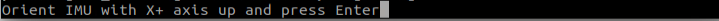

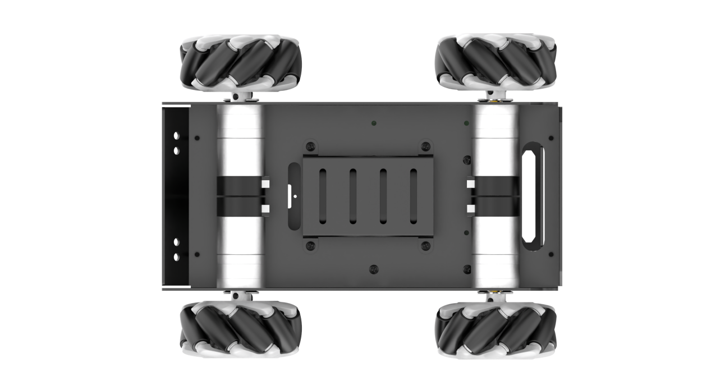

After you successfully calibrate all direction, the following prompt will appear.


(7) Align the robot to the rear, then press Enter.


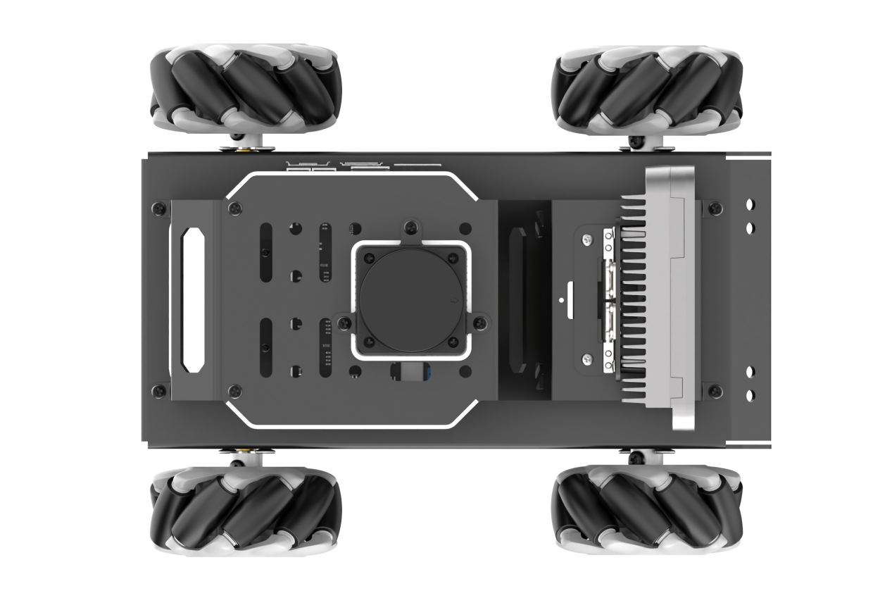

(8) Align the robot to the left, then hit Enter.


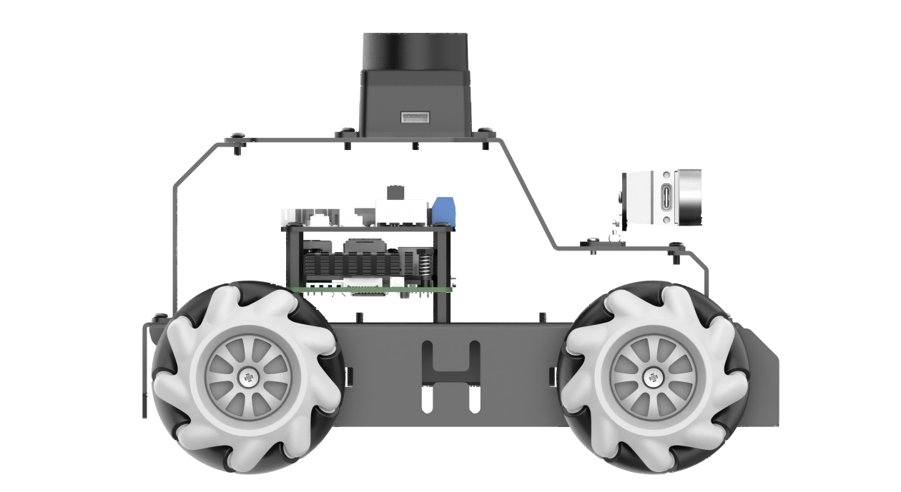

(9) Align the robot to the right, then press Enter.

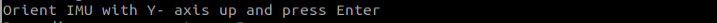


(10) Lift the robot, place it facing upwards, and press Enter. When positioning vertically, be careful to avoid instability or collisions. Use your hand for support to prevent damage to the depth camera or 2D pan-tilt.


(11) Place the robot as pictured, then hit Enter.


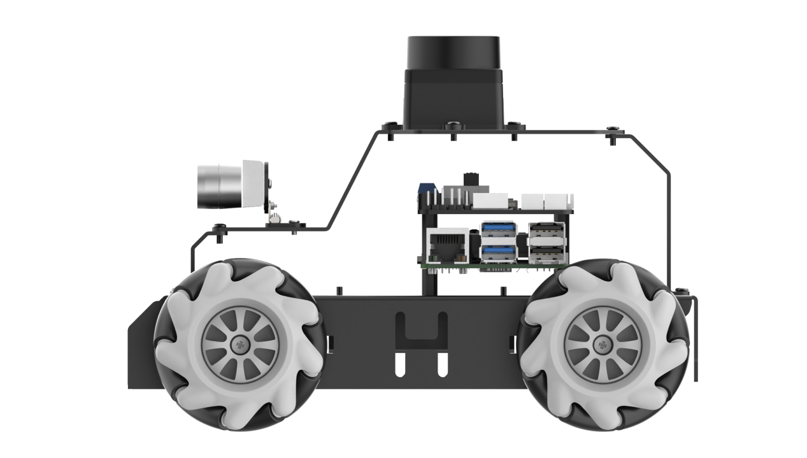

(12) If the below prompt shows up, it means the calibration is complete. To exit, use short-cut "**ctrl+c**".

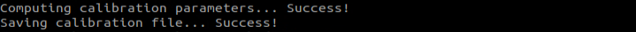

(13) After calibration, execute the command to verify the calibrated model.

```bash
ros2 launch peripherals imu_view.launch.py
```

(14) You can rotate the robot to see if it matches the angle and direction of the model.


(15) If you want to exit the game, press "**Ctrl+C**" in the terminal interface.

After experiencing the game, you can enable the app service through commands or by restarting the robot. If the app is not enabled, the related app functions will not work. If the robot is restarted, the app will be automatically enabled.

Click  and enter the command. Press enter to start the app, and wait for the buzzer to beep.

:::{Note}

please enter the command in the system path, not in the Docker container.

:::

```bash
sudo systemctl restart start_node.service
```

### 3.3.2 Angular Velocity Calibration

The MentorPi of the Ackerman version does not need angular velocity calibration.

To calibrate the angular velocity, the robot needs to perform a full rotation independently. During testing, it's crucial to mark the robot's orientation to facilitate the observation of any deviations. The specific steps are outlined below:

:::{Note}

The input command is case-sensitive, and keywords can be completed using the Tab key.

:::

(1) Place the robot on a flat surface and place a piece of tape or other marker in front of the robot's center.

(2) Start the robot, and connect it to the robot system desktop using VNC.

(3) Click-on  to open the command-line terminal.

(4) Enter the command and hit Enter to disable the app auto-start service.

```bash
~/.stop_ros.sh
```

(5) Before calibration, access the directory of calibration configuration files to open the files.

```bash
cd ~/ros2_ws/src/driver/controller/config && vim calibrate_params.yaml
```

(6) Modify the angular velocity parameter to 1.0, then proceed with the calibration.


(7) After modifying, press "**ESC**" . Enter "**:wq**" to exit and save.

(8) Enter the command and press enter to start the angular velocity calibration.

```bash
ros2 launch calibration angular_calib.launch.py
```

(9) Click **"calibrate_angular"** on the left side. The calibration interface will appear as shown below.


`test_angle`: Specifies the test rotation angle, with a default value of 360°.

`speed`: Indicates the linear velocity, set by default to 0.15 meters per second.

`tolerance`: Represents the allowable error margin. A smaller value leads to more noticeable oscillation when the robot reaches the target position.

`odom_angle_scale_correction`: Used to adjust the scale correction for odometry angle measurements.

`start_test`: A button to initiate the test for odometry angle scale correction.


Ensure the robot is properly aligned, with the marker placed in front of it. Check the `start_test` option and the robot will rotate in place. If it fails to complete a full rotation, you need to adjust the `odom_angule_scale_correction` value, which controls the motor's rotation scale. It is recommended to adjust this value in increments of 0.01.


(10) After calibration, enter the command to navigate to the directory containing calibration configuration files. Modify to the calibrated parameter value.

```bash
cd ~/ros2_ws/src/driver/controller/config && vim calibrate_params.yaml
```

(11) Press 'I' key to navigate to the editing mode, and modify the value of `angular_correctqion_factor` to the adjusted value of "**odom_angule_scale_correction**".


:::{Note}

The aforementioned operations are conducted on the Mecanum-wheel version.

:::

(12) After modification, press the "**ESC**" key, enter "**:wq**" to exit and save the changes.

(13) If you want to exit the game, press "**Ctrl+C**" in the terminal interface.

(14) After experiencing the game, you can enable the app service through commands or by restarting the robot. If the app is not enabled, the related app functions will not work. If the robot is restarted, the app will be automatically enabled.

Click   and enter the corresponding command, press Enter to launch the app, and wait for the buzzer to beep as confirmation.

:::{Note}

Be sure to enter the command in the system path, not within the Docker container.

```bash
sudo systemctl restart start_node.service
```

:::

### 3.3.3 Linear Velocity Calibration

The MentorPi of the Ackerman version does not need linear velocity calibration.

:::{Note}

The input command is case-sensitive, and keywords can be completed using the Tab key.

:::

Position the robot on a flat and open surface. Mark the starting point with tape or any other indicator in front of the robot, and position the endpoint tape or another marker 1 meter ahead of the robot.

(1) Start the robot, and access the robot system desktop using VNC.

(2) Click-on  to open the command-line terminal.

(3) Execute the command and hit Enter to disable the app auto-start service.

```bash
~/.stop_ros.sh
```

(4) Before calibration, navigate to the directory of calibration configuration files to open them.

```bash
cd ~/ros2_ws/src/driver/controller/config && vim calibrate_params.yaml
```

(5) Modify the linear velocity parameter `linear_correction_factor` to 1.0, then proceed with the calibration.


(6) After modifying, press "**ESC**" . Enter "**:wq**" to exit and save.

(7) Enter the command and press enter to start the linear velocity calibration.

```bash
ros2 launch calibration linear_calib.launch.py
```

(8) Click `calibrate_linear` on the left side. The calibration interface will appear as shown below.

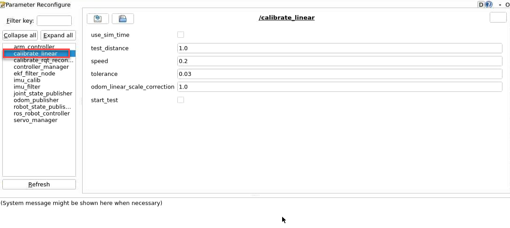

The meanings of parameters on the left side of the interface are as follows:

The first parameter `test_distance` represents the testing distance, with a default value of 1 meter.

The second parameter `speed` represents the linear velocity, with a default value of 0.2 meters per second.

The third parameter `tolerance` represents the error value. A smaller error value results in greater robot shaking after reaching the target position.

The fourth parameter `odom_linear_scale_correction` represents the odometer linear scale correction.

The fifth parameter `start_test` is the button to start testing the odometer linear scale correction.


(9) Ensure the robot is properly aligned and positioned at the starting point marker. Check the box for `start_test` and the robot will move forward. Observe if the robot travels in a straight line. If there is deviation, adjust the value of `odom_linear_scale_correction`. This value adjusts the motor's scaling factor for forward movement. It is recommended to adjust this value by increments of 0.01 each time.


(10) After calibration, enter the command to navigate to the directory containing calibration configuration files. Modify to the calibrated parameter value.

```bash
cd ~/ros2_ws/src/driver/controller/config && vim calibrate_params.yaml
```

(11) Press 'I' key to navigate to the editing mode, and modify the value of "**linear_correctqion_factor**" to the adjusted value of "**odom_linear_scale_correction**".


(12) After modification, press the "**ESC**" key, enter "**:wq**" to exit and save the changes.

(13) If you want to exit the game, press "**Ctrl+C**" in the terminal interface.

After experiencing the game, you can enable the app service through commands or by restarting the robot. If the app is not enabled, the related app functions will not work. If the robot is restarted, the app will be automatically enabled.

Click  and enter the command. Press enter to start the app, and wait for the buzzer to beep. Please enter the command in the system path, not in the Docker container.

```bash
sudo systemctl restart start_node.service
```

## 3.4 Publish IMU and Odometer Data

In robot navigation, accurately calculating real-time position is essential. Normally, we obtain odometer information using motor encoders and the robot's kinematic model. However, in specific situations, like when the robot's wheels rotate in place or when the robot is lifted, it may move a distance without the wheels actually turning.

To address wheel slip or accumulated errors in such cases, combining IMU and odometer data can yield more precise odometer information. This improves mapping and navigation accuracy in scenarios where wheel slip or cumulative errors may occur.

### 3.4.1 Introduction to IMU and Odometer

The IMU (Inertial Measurement Unit) is a device that measures the three-axis attitude angles (angular velocity) and acceleration of an object. It consists of the gyroscope and accelerometer as its main components, providing a total of 6 degrees of freedom to measure the object's angular velocity and acceleration in three-dimensional space.

An odometer is a method used to estimate changes in an object's position over time using data obtained from motion sensors. This method is widely applied in robotic systems to estimate the distance traveled by the robot relative to its initial position.

There are common methods for odometer positioning, including the wheel odometer, visual odometer, and visual-inertial odometer. In robotics, we specifically use the wheel odometer. To illustrate the principle of the wheel odometer, consider a carriage where you want to determine the distance from point A to point B. By knowing the circumference of the carriage wheels and installing a device to count wheel revolutions, you can calculate the distance based on wheel circumference, time taken, and the number of wheel revolutions.

While the wheel odometer provides basic pose estimation for wheeled robots, it has a significant drawback: accumulated error. In addition to inherent hardware errors, environmental factors such as slippery tires due to weather conditions contribute to increasing odometer errors with the robot's movement distance.

Therefore, both IMU and odometer are essential components in a robot. These two components are utilized to measure the three-axis attitude angles (or angular velocity) and acceleration of the object, as well as to estimate the distance, pose, velocity, and direction of the robot relative to its initial position.

To address these errors, we combine IMU data with odometer data to obtain more accurate information. IMU data is published through the "**/imu**" topic, and odometer data is published through "**/odom**". After obtaining data from both sources, the data is fused using the "**ekf**" package in ROS, and the fused localization information is then republished.

* **IMU Data Publishing** 

(1) Initiate Service

:::{Note}

The input command is case-sensitive, and keywords can be completed using the Tab key.

:::

① Start the robot, and access the robot system desktop using VNC.

② Click-on  to open the command-line terminal.

③ Execute the command, and hit Enter to disable the app auto-start service.

```bash
~/.stop_ros.sh
```

④ Enter the command and press Enter to enable the chassis control node.

```bash
ros2 launch ros_robot_controller ros_robot_controller.launch.py
```

⑤ Create a new command line terminal. Enter the command and press Enter to publish the IMU data.

```bash
ros2 launch peripherals imu_filter.launch.py
```

(2) Data Viewing

① Open a new command line terminal, and execute the command to check the current topic.

```bash
ros2 topic list
```


② Enter the command to view the type, publisher, and subscribers of the "**/imu**" topic. You can replace "**/imu**" with the topic you want to view. The type of this topic is "**sensor_msgs/msg/Imu**".

```bash
ros2 topic info /imu
```


③ Use the following command to display the content of the topic message. Feel free to replace '**imu**' with the name of the topic you wish to view.

```bash
ros2 topic echo /imu
```


The terminal will display the data from the three axes of the IMU.

④ If you want to exit the game, press "**Ctrl+C**" in the terminal interface.

After experiencing the game, you can enable the app service through commands or by restarting the robot. If the app is not enabled, the related app functions will not work. If the robot is restarted, the app will be automatically enabled.

Click  and enter the command. Press enter to start the app, and wait for the buzzer to beep. Please enter the command in the system path, not in the Docker container.

```bash
sudo systemctl restart start_node.service
```

* **Odometer Data Publishing** 

(1) Initiate Service

:::{Note}

The input command is case-sensitive, and keywords can be completed using the Tab key.

:::

① Start the robot, and connect it to the robot system desktop using VNC.

② Click-on  to open the command-line terminal.

③ Enter the command and hit Enter to disable the app auto-start service.

```bash
~/.stop_ros.sh
```

④ Run the command to publish the odometer data.

```bash
ros2 launch controller odom_publisher.launch.py
```

(2) Data Viewing

① Open a new command line terminal, and run the command below to check the current topic.

```bash
ros2 topic list
```


② Enter the command to view the type, publisher, and subscribers of the `/odom_raw` topic. You can replace `/odom_raw` with the topic you want to view. The type of this topic is `nav_msgs/msg/Odometry`.

```bash
ros2 topic info /odom_raw
```


③ Enter the command to print the topic message contents. You can replace the topic you want to view as needed.

```bash
ros2 topic echo /odom_raw
```


The message content includes acquired pose and velocity data.

④ If you want to exit the game, press "**Ctrl+C**" in the terminal interface.

After experiencing the game, you can enable the app service through commands or by restarting the robot. If the app is not enabled, the related app functions will not work. If the robot is restarted, the app will be automatically enabled.

Click  and enter the command. Press enter to start the app, and wait for the buzzer to beep. Please enter the command in the system path, not in the Docker container.

```bash
sudo systemctl restart start_node.service
```


## 3.5 Mecanum Wheel Chassis Speed Control

Speed control is achieved by adjusting the linear and angular velocity parameter.

### 3.5.1 Program Logic

Based on the robot's movement characteristics, control the active wheels to achieve forward, backward, and turning movements.

In the program, subscribe to the '/controller/cmd_vel' movement control topic to obtain the set linear and angular velocities. Then, analyze and calculate based on these velocities to determine the car's movement speed.

The source code for this program can be found at:

[/home/ubuntu/ros2_ws/src/driver/controller/controller/odom_publisher_node.py](../_static/source_code/controller.zip)

### 3.5.2 Disable APP Service and Initiate Speed Control

:::{Note}

The input command is case-sensitive, and keywords can be completed using the Tab key.

:::

(1) Start the robot, and connect it to the robot system desktop using VNC.

(2) Click-on  to open the command-line terminal.

(3) Enter the command and hit Enter to disable the app auto-start service.

```bash
~/.stop_ros.sh
```

(4) Enter the command to enable motion control service.

```bash
ros2 launch controller controller.launch.py
```

* **Modify Linear Velocity** 

(1) Open a new ROS2 command-line terminal, then enter the following command to enable the linear velocity control.

```bash
ros2 topic pub /controller/cmd_vel geometry_msgs/Twist "linear:

x: 0.0

y: 0.0

z: 0.0

angular:

x: 0.0

y: 0.0

z: 0.0"
```

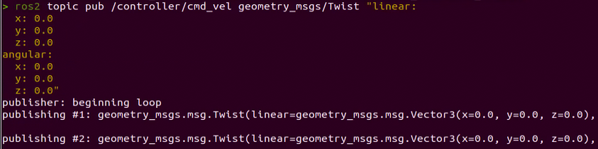

In this context, `linear` represents the set linear velocity, considering the robot's viewpoint where the X-axis points forward without any influence from the Y or Z directions.

On the other hand, `angular` pertains to the set angular velocity. A positive Z-value induces a left turn in the robot, while a negative Z-value causes the robot to turn right. This configuration has no impact on the X and Y directions.

:::{Note}

* In this scenario, the linear velocity (x) is measured in meters per second, and it is advisable to maintain it within the range of "**-0.6 to 0.6**".

* The angular velocity (z) denotes the turning speed and is determined by the formulas V=ωR (linear velocity equals angular velocity times radius) and tanΦA=D/R (where z=ω, D=0.213, and ΦA represents the turning angle). The angle ΦA should be within the range of 0 to 36 degrees.

:::

"**angular**" sets the angular velocity of the robot. A positive value for "**Z**" will make the robot turn left, while a negative value for "**Z**" will make it turn right. There is no motion in the X and Y directions.

(2) Use the arrow keys to navigate and modify the relevant parameters. For example, to make the robot move forward, adjust the linear velocity (X) to 0.1, and then press Enter to execute the action.


(3) To bring the robot car to a stop, open a new terminal and set the linear velocity to '0.0'.


(4) If you need to terminate this program, use short-cut 'Ctrl+C'.

:::{Note}

To bring the robot car to a stop, please create a new terminal and adjust the linear velocity. Using the 'Ctrl+C' shortcut alone may not effectively halt the robot car.

:::

* **Modify Angular Velocity** 

(1) Open a new ROS2 command-line terminal, then enter the following command to enable the angular velocity control.

```
ros2 topic pub /controller/cmd_vel geometry_msgs/Twist "linear:

x: 0.0

y: 0.0

z: 0.0

angular:

x: 0.0

y: 0.0

z: 0.0"
```

`angular` sets the angular velocity of the robot. A positive value for "**Z**" will make the robot turn left, while a negative value for "**Z**" will make it turn right. There is no motion in the X and Y directions.

:::{Note}

* In this scenario, the linear velocity (x) is measured in meters per second, and it is advisable to maintain it within the range of "**-0.6 to 0.6**".

* "**Z**" represents the angular velocity for turning, which is the yaw angular velocity of the robot. It is recommended to set the value between "**-2**" and "**2**". A value of "**0**" means there is no angular velocity, a positive value means counterclockwise rotation, and a negative value means clockwise rotation. The absolute value of the angular velocity represents the speed of rotation, with larger values indicating faster rotation.

:::

(2) Use the arrow keys to navigate and modify the relevant parameters. For example, to make the robot turn left, adjust the angular velocity (Z) to 1.0, and then press Enter to execute the action.


(3) To bring the robot car to a stop, open a new terminal and set the angular velocity to '0.0'.


(4) If you want to exit the game, press "**Ctrl+C**" in the terminal interface.

:::Note

Create a new terminal to stop the robot, and then close the node to shut down properly. If you directly press Ctrl+C to close the terminal, the robot may not stop.

:::

After experiencing the game, you can enable the app service through commands or by restarting the robot. If the app is not enabled, the related app functions will not work. If the robot is restarted, the app will be automatically enabled.

Click  and enter the command. Press enter to start the app, and wait for the buzzer to beep. Please enter the command in the system path, not in the Docker container.

```bash
sudo systemctl restart start_node.service
```

### 3.5.3 Program Analysis


The files include `controller.launch.py` for launch configuration, `calibrate_params.yaml` for parameter configuration, and `odom_publisher.py` for program execution.

During startup, the launch file is executed first. It loads the YAML configuration file and passes the parameters to the ROS nodes. Subsequently, the nodes initialize by reading the configuration parameters from the ROS nodes and communicate with other nodes to collaboratively implement functionalities.

* **Launch File** 


The launch file is located in: [/home/ubuntu/ros2_ws/src/driver/controller/launch/controller.launch.py](../_static/source_code/controller.zip)

(1) Set the storage path

Retrieve the paths for the two packages: peripherals and controller.

{lineno-start=34}

```python
    if compiled == 'True':
        peripherals_package_path = get_package_share_directory('peripherals')
        controller_package_path = get_package_share_directory('controller')
    else:
        peripherals_package_path = '/home/ubuntu/ros2_ws/src/peripherals'
        controller_package_path = '/home/ubuntu/ros2_ws/src/driver/controller'
```

(2) Initiate other Launch files

{lineno-start=42}

```python
    odom_publisher_launch = IncludeLaunchDescription(
        PythonLaunchDescriptionSource([os.path.join(controller_package_path, 'launch/odom_publisher.launch.py')
        ]),
        launch_arguments={
            'namespace': namespace,
            'use_namespace': use_namespace,
            'imu_frame': imu_frame,
            'frame_prefix': frame_prefix,
            'base_frame': base_frame,
            'odom_frame': odom_frame
        }.items()
    )

    imu_filter_launch = IncludeLaunchDescription(
        PythonLaunchDescriptionSource([os.path.join(peripherals_package_path, 'launch/imu_filter.launch.py')
        ])
    )
```

odom_publisher_launch Odometer launch

imu_filter_launch IMU launch

(3) Initiate Node

Launch the EKF fusion node.

{lineno-start=60}

```python
    if use_namespace == 'false':
        ekf_param = ReplaceString(source_file=os.path.join(controller_package_path, 'config/ekf.yaml'), replacements={'namespace/': ''})
    else:
        ekf_param = ReplaceString(source_file=os.path.join(controller_package_path, 'config/ekf.yaml'), replacements={"namespace/": (namespace, '/')})
    
    ekf_filter_node = Node(
        package='robot_localization',
        executable='ekf_node',
        name='ekf_filter_node',
        output='screen',
        parameters=[ekf_param, {'use_sim_time': use_sim_time}],
        remappings=[
            ('/tf', 'tf'),
            ('/tf_static', 'tf_static'),
            ('odometry/filtered', 'odom'),
            ('cmd_vel', 'controller/cmd_vel')
        ],
        condition=IfCondition(enable_odom),
    )
```

* **Python Program**


The Python program is saved in: [/home/ubuntu/ros2 ws/src/driver/controller/controller/odom publisher node.py](../_static/source_code/controller.zip)

(1) Import Library

{lineno-start=1}

```python
import os
import math
import time
import rclpy
import signal
import threading
from rclpy.node import Node
from std_srvs.srv import Trigger
from nav_msgs.msg import Odometry
from controller import ackermann, mecanum
from ros_robot_controller_msgs.msg import MotorsState, SetPWMServoState, PWMServoState
from geometry_msgs.msg import Pose2D, Pose, Twist, PoseWithCovarianceStamped, TransformStamped
```

(2) Main Function

{lineno-start=288}

```python
def main():
    node = Controller('odom_publisher')
    rclpy.spin(node)  
if __name__ == "__main__":
    main()
```

The controller class is invoked here, and wait for the node to exit.

(3) Global Parameter

{lineno-start=16}

```python
ODOM_POSE_COVARIANCE = list(map(float, 
                        [1e-3, 0, 0, 0, 0, 0, 
                        0, 1e-3, 0, 0, 0, 0,
                        0, 0, 1e6, 0, 0, 0,
                        0, 0, 0, 1e6, 0, 0,
                        0, 0, 0, 0, 1e6, 0,
                        0, 0, 0, 0, 0, 1e3]))

ODOM_POSE_COVARIANCE_STOP = list(map(float, 
                            [1e-9, 0, 0, 0, 0, 0, 
                             0, 1e-3, 1e-9, 0, 0, 0,
                             0, 0, 1e6, 0, 0, 0,
                             0, 0, 0, 1e6, 0, 0,
                             0, 0, 0, 0, 1e6, 0,
                             0, 0, 0, 0, 0, 1e-9]))

ODOM_TWIST_COVARIANCE = list(map(float, 
                        [1e-3, 0, 0, 0, 0, 0, 
                         0, 1e-3, 0, 0, 0, 0,
                         0, 0, 1e6, 0, 0, 0,
                         0, 0, 0, 1e6, 0, 0,
                         0, 0, 0, 0, 1e6, 0,
                         0, 0, 0, 0, 0, 1e3]))

ODOM_TWIST_COVARIANCE_STOP = list(map(float, 
                            [1e-9, 0, 0, 0, 0, 0, 
                              0, 1e-3, 1e-9, 0, 0, 0,
                              0, 0, 1e6, 0, 0, 0,
                              0, 0, 0, 1e6, 0, 0,
                              0, 0, 0, 0, 1e6, 0,
                              0, 0, 0, 0, 0, 1e-9]))
```

<table  class="docutils" border="1" style="text-align:center;">
  <thead>
    <tr>
      <th>Parameter Name</th>
      <th>Description</th>
    </tr>
  </thead>
  <tbody>
    <tr>
      <td>ODOM_POSE_COVARIANCE</td>
      <td>Mileage POSE covariance</td>
    </tr>
    <tr>
      <td>ODOM_POSE_COVARIANCE_STOP</td>
      <td>When speed is 0, Odometer POSE covariance</td>
    </tr>
    <tr>
      <td>ODOM_TWIST_COVARIANCE</td>
      <td>Mileage TWIST covariance</td>
    </tr>
    <tr>
      <td>ODOM_TWIST_COVARIANCE_STOP</td>
      <td>When speed is 0, Mileage TWIST covariance</td>
    </tr>
  </tbody>
</table>

(4) Function

{lineno-start=48}

```python
def rpy2qua(roll, pitch, yaw):
    cy = math.cos(yaw*0.5)
    sy = math.sin(yaw*0.5)
    cp = math.cos(pitch*0.5)
    sp = math.sin(pitch*0.5)
    cr = math.cos(roll * 0.5)
    sr = math.sin(roll * 0.5)
    
    q = Pose()
    q.orientation.w = cy * cp * cr + sy * sp * sr
    q.orientation.x = cy * cp * sr - sy * sp * cr
    q.orientation.y = sy * cp * sr + cy * sp * cr
    q.orientation.z = sy * cp * cr - cy * sp * sr
    return q.orientation

def qua2rpy(x, y, z, w):
    roll = math.atan2(2 * (w * x + y * z), 1 - 2 * (x * x + y * y))
    pitch = math.asin(2 * (w * y - x * z))
    yaw = math.atan2(2 * (w * z + x * y), 1 - 2 * (z * z + y * y))
  
    return roll, pitch, yaw
```

The function`rpy2qua` is used to convert Euler angles to quaternions.

The function `qua2rpy` is used to convert quaternions to Euler angles.

(5) Analysis of the Controller Class

① Invoke kinematics

{lineno-start=48}

```python
self.ackermann = ackermann.AckermannChassis(wheelbase=0.145, track_width=0.133, wheel_diameter=0.067)
self.mecanum = mecanum.MecanumChassis(wheelbase=0.1368, track_width=0.1446, wheel_diameter=0.065)
```

The  `self.ackermann` calls the Ackermann kinematics and initializes the Ackermann kinematics object.

The  `self.mecanum` calls the Mecanum kinematics and initializes the Mecanum kinematics object.

② Define ROS parameters:

{lineno-start=48}

```python
        # Declare parameters
        self.declare_parameter('pub_odom_topic', True)
        self.declare_parameter('base_frame_id', 'base_footprint')
        self.declare_parameter('odom_frame_id', 'odom')
        self.declare_parameter('linear_correction_factor', 1.00)
        self.declare_parameter('linear_correction_factor_tank', 0.52)
        self.declare_parameter('angular_correction_factor', 1.00)
        self.declare_parameter('machine_type', os.environ['MACHINE_TYPE'])
        
        self.pub_odom_topic = self.get_parameter('pub_odom_topic').value
        self.base_frame_id = self.get_parameter('base_frame_id').value
        self.odom_frame_id = self.get_parameter('odom_frame_id').value
        
        #self.machine_type = os.environ.get('MACHINE_TYPE', 'MentorPi_Mecanum')
        self.machine_type = self.get_parameter('machine_type').value
```

pub_odom_topic: Whether to publish the odometry node

`base_frame_id`: Robot footprint ID

`odom_frame_id`: Robot odometry ID

`linear_correction_facto`r: Linear velocity correction factor

`angular_correction_factor`: Angular velocity correction factor

`machine_type`: Type of robot

③ Publish odometer:

{lineno-start=111}

```python
        if self.pub_odom_topic:
            # self.odom_broadcaster = tf2_ros.TransformBroadcaster(self)            # self.odom_trans = TransformStamped()
            # self.odom_trans.header.frame_id = self.odom_frame_id
            # self.odom_trans.child_frame_id = self.base_frame_id
            
            self.odom = Odometry()
            self.odom.header.frame_id = self.odom_frame_id
            self.odom.child_frame_id = self.base_frame_id
            
            self.odom.pose.covariance = ODOM_POSE_COVARIANCE
            self.odom.twist.covariance = ODOM_TWIST_COVARIANCE
            
            self.odom_pub = self.create_publisher(Odometry, 'odom_raw', 1)
            self.dt = 1.0/50.0

            threading.Thread(target=self.cal_odom_fun, daemon=True).start()
```

Based on the parameter `pub_odom_topic`, determine whether to publish the odometry node. If publishing is required, initialize the node, fill in the corresponding parameters, and publish the odometry using the `self.create_publisher` function. Update the odometry data using the `self.cal_odom_fun` function.

④ Topic Publishing:

{lineno-start=127}

```python
        self.get_logger().info('033[1;32m%f %f033[0m' % (self.linear_factor, self.angular_factor))
        self.motor_pub = self.create_publisher(MotorsState, 'ros_robot_controller/set_motor', 1)
        self.servo_state_pub = self.create_publisher(SetPWMServoState, 'ros_robot_controller/pwm_servo/set_state', 10)
        self.pose_pub = self.create_publisher(PoseWithCovarianceStamped, 'set_pose', 1)
        self.create_subscription(Pose2D, 'set_odom', self.set_odom, 1)
        self.create_subscription(Twist, 'controller/cmd_vel', self.cmd_vel_callback, 1)
        #self.create_subscription(Twist, '/app/cmd_vel', self.acker_cmd_vel_callback, 1)
        self.create_subscription(Twist, 'cmd_vel', self.app_cmd_vel_callback, 1)
        self.create_service(Trigger, 'controller/load_calibrate_param', self.load_calibrate_param)
        self.create_service(Trigger, '~/init_finish', self.get_node_state)
        self.get_logger().info('033[1;32m%s033[0m' % 'start')
```

self.motor_pub publishes the motor control topic `ros_robot_controller/set_motor`, with the message type MotorsState.

self.servo_state_pub publishes the servo control topic `ros_robot_controller/bus_servo/set_state`, with the message type SetBusServoState.

self.pose_pub publishes the servo control topic `set_pose`, with the message type PoseWithCovarianceStamped.

Publishes the topic`set_odom`, with the message type Pose2D, and the callback function self.set_odom.

Publishes the topic`controller/cmd_vel`, with the message type Twist, and the callback function self.cmd_vel_callback.

Publishes the topic `cmd_vel`, with the message type Twist, and the callback function self.set_app_cmd_vel_callback.

Publishes the service `controller/load_calibrate_param`, with the service type Trigger, and the callback function self.load_calibrate_param.

Publishes the service `~/init_finish`, with the service type Trigger, and the callback function self.get_node_state.

⑤ Explanation of Controller Class Functions:

<table  class="docutils" border="1" style="text-align:center;">
  <thead>
    <tr>
      <th>Function Name</th>
      <th>Description</th>
    </tr>
  </thead>
  <tbody>
    <tr>
      <td>get_node_state</td>
      <td>Used to obtain the current node status, as a callback function</td>
    </tr>
    <tr>
      <td>shutdown</td>
      <td>Used to shut down the ROS node, as a callback function<br></td>
    </tr>
    <tr>
      <td>load_callbrate_param</td>
      <td>Used to read the current motion parameters as a callback function</td>
    </tr>
    <tr>
      <td>set_odom</td>
      <td>Used to read and set odometry, as a callback function</td>
    </tr>
    <tr>
      <td>app_cmd_vel_callback</td>
      <td>Used to set the app speed, as a callback function</td>
    </tr>
    <tr>
      <td>cmd_vel_callback</td>
      <td>Used to set velocity, as a callback function</td>
    </tr>
    <tr>
      <td>cal_odom_fun</td>
      <td>Used to publish odometry data</td>
    </tr>
  </tbody>
</table>

* **FAQ**

Q: The robot continues to move forward even after pressing "**Ctrl+C**" in the terminal.

A: In such a situation, you need to open a new terminal and enter the command:

rostopic pub/hiwonder_controller/cmd_vel geometry_msgs/Twist "**linear:**", then press Tab to autocomplete. Set the speed to 0, and press Enter to execute.

## 3.6 Ackerman Chassis Speed Control

Speed control is achieved by adjusting the linear and angular velocity parameter.

### 3.6.1 Program Logic

Based on the robot's movement characteristics, control the active wheels to achieve forward, backward, and turning movements.

In the program, subscribe to the '/controller/cmd_vel' movement control topic to obtain the set linear and angular velocities. Then, analyze and calculate based on these velocities to determine the car's movement speed.

The source code for this program can be found at: [/home/ubuntu/ros2_ws/src/driver/controller/controller/odom_publisher_node.py](../_static/source_code/controller.zip)

### 3.6.2 Disable APP Service and Initiate Speed Control

:::Note

The input command is case-sensitive, and keywords can be completed using the Tab key.

:::

(1) Start the robot, and connect it to the robot system desktop using VNC.

(2) Click-on  to open the command-line terminal.

(3) Enter the command and hit Enter to disable the app auto-start service.

```bash
~/.stop_ros.sh
```

(4) Enter the command to enable motion control service.

```bash
ros2 launch controller controller.launch.py
```

* **Modify Linear Velocity** 

(1) Open a new ROS2 command-line terminal, then enter the following command to enable the linear velocity control.

```bash
ros2 topic pub /controller/cmd_vel geometry_msgs/Twist "linear:

x: 0.0

y: 0.0

z: 0.0

angular:

x: 0.0

y: 0.0

z: 0.0"
```

In this context, `linear` represents the set linear velocity, considering the robot's viewpoint where the X-axis points forward without any influence from the Y or Z directions.

On the other hand, `angular` pertains to the set angular velocity. A positive Z-value induces a left turn in the robot, while a negative Z-value causes the robot to turn right. This configuration has no impact on the X and Y directions.

:::{Note}

* In this scenario, the linear velocity (x) is measured in meters per second, and it is advisable to maintain it within the range of "**-0.6 to 0.6**".

* The angular velocity (z) denotes the turning speed and is determined by the formulas V=ωR (linear velocity equals angular velocity times radius) and tanΦA=D/R (where z=ω, D=0.213, and ΦA represents the turning angle). The angle ΦA should be within the range of 0 to 29 degrees.

:::

Use the arrow keys to navigate and modify the relevant parameters. For example, to make the robot move forward, adjust the linear velocity (X) to 0.1 and the angular velocity to 0.0. Then, press Enter to execute the action.


(2) To bring the robot car to a stop, open a new terminal and set the linear velocity to '0.0'.


(3) If you need to terminate this program, use short-cut 'Ctrl+C'.

:::{Note}

To bring the robot car to a stop, please create a new terminal and adjust the linear velocity. Using the 'Ctrl+C' shortcut alone may not effectively halt the robot car.

:::

* **Modify Angular Velocity** 

(1) Open a new ROS2 command-line terminal, then enter the following command to enable the angular velocity control.

```bash
ros2 topic pub /controller/cmd_vel geometry_msgs/Twist "linear:

x: 0.0

y: 0.0

z: 0.0

angular:

x: 0.0

y: 0.0

z: 0.0"
```

`angular` sets the angular velocity of the robot. A positive value for "**Z**" will make the robot turn left, while a negative value for "**Z**" will make it turn right. There is no motion in the X and Y directions. Ackerman chassis needs to add linear velocity to turn right.

:::{Note}

* In this scenario, the linear velocity (x) is measured in meters per second, and it is advisable to maintain it within the range of "**-0.6 to 0.6**".

* The angular velocity (z) denotes the turning speed and is determined by the formulas V=ωR (linear velocity equals angular velocity times radius) and tanΦA=D/R (where z=ω, D=0.213, and ΦA represents the turning angle). The angle ΦA should be within the range of 0 to 36 degrees.

:::

Use the arrow keys to navigate and modify the relevant parameters. For example, to make the robot turn left, adjust the angular velocity (Z) to 0.1 and the linear velocity (X) to 0.5. Then, press Enter to execute the action.

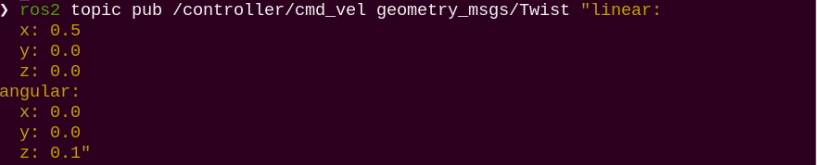

(2) To bring the robot car to a stop, open a new terminal and set the angular velocity to '0.0'.


(3) If you want to exit the game, press "**Ctrl+C**" in the terminal interface.

:::{Note}

Create a new terminal to stop the robot, and then close the node to shut down properly. If you directly press Ctrl+C to close the terminal, the robot may not stop.

:::

### 3.6.3 Program Analysis


The files include `controller.launch.py` for launch configuration, `calibrate_params.yaml` for parameter configuration, and `odom_publisher.py` for program execution.

During startup, the launch file is executed first. It loads the YAML configuration file and passes the parameters to the ROS nodes. Subsequently, the nodes initialize by reading the configuration parameters from the ROS nodes and communicate with other nodes to collaboratively implement functionalities.

* **Launch File**


The launch file is located in: [/home/ubuntu/ros2_ws/src/driver/controller/launch/controller.launch.py](../_static/source_code/controller.zip)

(1) Set the storage path

Retrieve the paths for the two packages: peripherals and controller.

{lineno-start=34}

```python
    if compiled == 'True':
        peripherals_package_path = get_package_share_directory('peripherals')
        controller_package_path = get_package_share_directory('controller')
    else:
        peripherals_package_path = '/home/ubuntu/ros2_ws/src/peripherals'
        controller_package_path = '/home/ubuntu/ros2_ws/src/driver/controller'
```

(2) Initiate other Launch files

{lineno-start=42}

```python
    odom_publisher_launch = IncludeLaunchDescription(
        PythonLaunchDescriptionSource([os.path.join(controller_package_path, 'launch/odom_publisher.launch.py')
        ]),
        launch_arguments={
            'namespace': namespace,
            'use_namespace': use_namespace,
            'imu_frame': imu_frame,
            'frame_prefix': frame_prefix,
            'base_frame': base_frame,
            'odom_frame': odom_frame
        }.items()
    )

    imu_filter_launch = IncludeLaunchDescription(
        PythonLaunchDescriptionSource([os.path.join(peripherals_package_path, 'launch/imu_filter.launch.py')
        ])
    )
```

odom_publisher_launch Odometer launch

imu_filter_launch IMU launch

(3) Initiate Node

Launch the EKF fusion node.

{lineno-start=60}

```python
    if use_namespace == 'false':
        ekf_param = ReplaceString(source_file=os.path.join(controller_package_path, 'config/ekf.yaml'), replacements={'namespace/': ''})
    else:
        ekf_param = ReplaceString(source_file=os.path.join(controller_package_path, 'config/ekf.yaml'), replacements={"namespace/": (namespace, '/')})
    
    ekf_filter_node = Node(
        package='robot_localization',
        executable='ekf_node',
        name='ekf_filter_node',
        output='screen',
        parameters=[ekf_param, {'use_sim_time': use_sim_time}],
        remappings=[
            ('/tf', 'tf'),
            ('/tf_static', 'tf_static'),
            ('odometry/filtered', 'odom'),
            ('cmd_vel', 'controller/cmd_vel')
        ],
        condition=IfCondition(enable_odom),
    )
```

* **Python Program**


The Python program is saved in: [/home/ubuntu/ros2_ws/src/driver/controller/controller/odom_publisher.node.py](../_static/source_code/controller.zip)

(1) Import Library

{lineno-start=3}

```python
import os
import math
import time
import rclpy
import signal
import threading
from rclpy.node import Node
from std_srvs.srv import Trigger
from nav_msgs.msg import Odometry
from controller import ackermann, mecanum
from ros_robot_controller_msgs.msg import MotorsState, SetPWMServoState, PWMServoState
from geometry_msgs.msg import Pose2D, Pose, Twist, PoseWithCovarianceStamped, TransformStamped
```

(2) Main Function

{lineno-start=288}

```python
def main():
    node = Controller('odom_publisher')
    rclpy.spin(node)  
if __name__ == "__main__":
    main()
```

The controller class is invoked here, and wait for the node to exit.

(3) Global Parameter

{lineno-start=16}

```python
ODOM_POSE_COVARIANCE = list(map(float, 
                        [1e-3, 0, 0, 0, 0, 0, 
                        0, 1e-3, 0, 0, 0, 0,
                        0, 0, 1e6, 0, 0, 0,
                        0, 0, 0, 1e6, 0, 0,
                        0, 0, 0, 0, 1e6, 0,
                        0, 0, 0, 0, 0, 1e3]))

ODOM_POSE_COVARIANCE_STOP = list(map(float, 
                            [1e-9, 0, 0, 0, 0, 0, 
                             0, 1e-3, 1e-9, 0, 0, 0,
                             0, 0, 1e6, 0, 0, 0,
                             0, 0, 0, 1e6, 0, 0,
                             0, 0, 0, 0, 1e6, 0,
                             0, 0, 0, 0, 0, 1e-9]))

ODOM_TWIST_COVARIANCE = list(map(float, 
                        [1e-3, 0, 0, 0, 0, 0, 
                         0, 1e-3, 0, 0, 0, 0,
                         0, 0, 1e6, 0, 0, 0,
                         0, 0, 0, 1e6, 0, 0,
                         0, 0, 0, 0, 1e6, 0,
                         0, 0, 0, 0, 0, 1e3]))

ODOM_TWIST_COVARIANCE_STOP = list(map(float, 
                            [1e-9, 0, 0, 0, 0, 0, 
                              0, 1e-3, 1e-9, 0, 0, 0,
                              0, 0, 1e6, 0, 0, 0,
                              0, 0, 0, 1e6, 0, 0,
                              0, 0, 0, 0, 1e6, 0,
                              0, 0, 0, 0, 0, 1e-9]))
```

<table  class="docutils" border="1" style="text-align:center;">
  <thead>
    <tr>
      <th>Parameter Name</th>
      <th>Description</th>
    </tr>
  </thead>
  <tbody>
    <tr>
      <td>ODOM_POSE_COVARIANCE</td>
      <td>Odometer POSE covariance</td>
    </tr>
    <tr>
      <td>ODOM_POSE_COVARIANCE_STOP</td>
      <td>When speed is 0,<br>Mileage POSE covariance</td>
    </tr>
    <tr>
      <td>ODOM_TWIST_COVARIANCE</td>
      <td>Mileage TWIST covariance</td>
    </tr>
    <tr>
      <td>ODOM_TWIST_COVARIANCE_STOP</td>
      <td>When speed is 0,<br>Mileage TWIST covariance</td>
    </tr>
  </tbody>
</table>

(4) Function

{lineno-start=48}

```python
def rpy2qua(roll, pitch, yaw):
    cy = math.cos(yaw*0.5)
    sy = math.sin(yaw*0.5)
    cp = math.cos(pitch*0.5)
    sp = math.sin(pitch*0.5)
    cr = math.cos(roll * 0.5)
    sr = math.sin(roll * 0.5)
    
    q = Pose()
    q.orientation.w = cy * cp * cr + sy * sp * sr
    q.orientation.x = cy * cp * sr - sy * sp * cr
    q.orientation.y = sy * cp * sr + cy * sp * cr
    q.orientation.z = sy * cp * cr - cy * sp * sr
    return q.orientation

def qua2rpy(x, y, z, w):
    roll = math.atan2(2 * (w * x + y * z), 1 - 2 * (x * x + y * y))
    pitch = math.asin(2 * (w * y - x * z))
    yaw = math.atan2(2 * (w * z + x * y), 1 - 2 * (z * z + y * y))
  
    return roll, pitch, yaw
```

The function `rpy2qua`is used to convert Euler angles to quaternions.

The function `qua2rpy` is used to convert quaternions to Euler angles.

(5) Analysis of the Controller Class

Invoke kinematics

{lineno-start=87}

```python
        self.ackermann = ackermann.AckermannChassis(wheelbase=0.145, track_width=0.133, wheel_diameter=0.067)
        self.mecanum = mecanum.MecanumChassis(wheelbase=0.1368, track_width=0.1446, wheel_diameter=0.065)
```

The  `self.ackermann`  calls the Ackermann kinematics and initializes the Ackermann kinematics object.

The  `self.mecanum ` calls the Mecanum kinematics and initializes the Mecanum kinematics object.

(6) Define ROS parameters:

{lineno-start=89}

```python
        # Declare parameters
        self.declare_parameter('pub_odom_topic', True)
        self.declare_parameter('base_frame_id', 'base_footprint')
        self.declare_parameter('odom_frame_id', 'odom')
        self.declare_parameter('linear_correction_factor', 1.00)
        self.declare_parameter('linear_correction_factor_tank', 0.52)
        self.declare_parameter('angular_correction_factor', 1.00)
        self.declare_parameter('machine_type', os.environ['MACHINE_TYPE'])
        
        self.pub_odom_topic = self.get_parameter('pub_odom_topic').value
        self.base_frame_id = self.get_parameter('base_frame_id').value
        self.odom_frame_id = self.get_parameter('odom_frame_id').value
```

The function  `self.declare_parameter` is used to define a certain parameter.

The function  `self.get_parameter` is used to obtain a certain parameter.

`pub_odom_topic`: Whether to publish the odometry node

`base_frame_id`: Robot footprint ID

`odom_frame_id`: Robot odometry ID

`linear_correction_factor`: Linear velocity correction factor

`angular_correction_factor`: Angular velocity correction factor

`machine_type`: Type of robot

(7) Publish odometer:

{lineno-start=111}

```python
        if self.pub_odom_topic:
            # self.odom_broadcaster = tf2_ros.TransformBroadcaster(self)            # self.odom_trans = TransformStamped()
            # self.odom_trans.header.frame_id = self.odom_frame_id
            # self.odom_trans.child_frame_id = self.base_frame_id
            
            self.odom = Odometry()
            self.odom.header.frame_id = self.odom_frame_id
            self.odom.child_frame_id = self.base_frame_id
            
            self.odom.pose.covariance = ODOM_POSE_COVARIANCE
            self.odom.twist.covariance = ODOM_TWIST_COVARIANCE
            
            self.odom_pub = self.create_publisher(Odometry, 'odom_raw', 1)
            self.dt = 1.0/50.0

            threading.Thread(target=self.cal_odom_fun, daemon=True).start()
```

Based on the parameter `pub_odom_topic`, determine whether to publish the odometry node. If publishing is required, initialize the node, fill in the corresponding parameters, and publish the odometry using the `self.create_publisher`function. Update the odometry data using the `self.cal_odom_fun` function.

(8) Topic Publishing:

{lineno-start=127}

```python
        self.get_logger().info('033[1;32m%f %f033[0m' % (self.linear_factor, self.angular_factor))
        self.motor_pub = self.create_publisher(MotorsState, 'ros_robot_controller/set_motor', 1)
        self.servo_state_pub = self.create_publisher(SetPWMServoState, 'ros_robot_controller/pwm_servo/set_state', 10)
        self.pose_pub = self.create_publisher(PoseWithCovarianceStamped, 'set_pose', 1)
        self.create_subscription(Pose2D, 'set_odom', self.set_odom, 1)
        self.create_subscription(Twist, 'controller/cmd_vel', self.cmd_vel_callback, 1)
        #self.create_subscription(Twist, '/app/cmd_vel', self.acker_cmd_vel_callback, 1)
        self.create_subscription(Twist, 'cmd_vel', self.app_cmd_vel_callback, 1)
        self.create_service(Trigger, 'controller/load_calibrate_param', self.load_calibrate_param)
        self.create_service(Trigger, '~/init_finish', self.get_node_state)
        self.get_logger().info('033[1;32m%s033[0m' % 'start')
```

The function `self.create_subscription` is used to receive topics.

The function  `self.create_service` is used to create services.

`self.motor_pub` publishes the motor control topic  `ros_robot_controller/set_motor` with the message type MotorsState.

`self.servo_state_pub` publishes the servo control topic  `ros_robot_controller/bus_servo/set_state`, with the message type SetBusServoState.

`self.pose_pub` publishes the servo control topic `set_pose`, with the message type PoseWithCovarianceStamped.

Publishes the topic  `set_odom`, with the message type Pose2D, and the callback function self.set_odom.

Publishes the topic  `controller/cmd_vel`, with the message type Twist, and the callback function self.cmd_vel_callback.

Publishes the topic  `cmd_vel`, with the message type Twist, and the callback function self.set_app_cmd_vel_callback.

Publishes the service  `controller/load_calibrate_param`, with the service type Trigger, and the callback function self.load_calibrate_param.

Publishes the service  `~/init_finish`, with the service type Trigger, and the callback function `self.get_node_state`.

(9) Explanation of Controller Class Functions:

<table  class="docutils" border="1" style="text-align:center;">
  <thead>
    <tr style="background-color: #f2f2f2;">
      <th style="padding: 8px; border: 1px solid #ddd;">Function Name</th>
      <th style="padding: 8px; border: 1px solid #ddd;">Description</th>
    </tr>
  </thead>
  <tbody>
    <tr>
      <td style="padding: 8px; border: 1px solid #ddd;">get_node_state</td>
      <td style="padding: 8px; border: 1px solid #ddd;">Used to obtain the current node status, as a callback function</td>
    </tr>
    <tr>
      <td style="padding: 8px; border: 1px solid #ddd;">shutdown</td>
      <td style="padding: 8px; border: 1px solid #ddd;">
        Used to shut down the ROS node, as a callback function<br>
      </td>
    </tr>
    <tr>
      <td style="padding: 8px; border: 1px solid #ddd;">load_callbrate_param</td>
      <td style="padding: 8px; border: 1px solid #ddd;">Used to read the current motion parameters as a callback function</td>
    </tr>
    <tr>
      <td style="padding: 8px; border: 1px solid #ddd;">set_odom</td>
      <td style="padding: 8px; border: 1px solid #ddd;">Used to read and set odometry, as a callback function</td>
    </tr>
    <tr>
      <td style="padding: 8px; border: 1px solid #ddd;">app_cmd_vel_callback</td>
      <td style="padding: 8px; border: 1px solid #ddd;">Used to set the app speed, as a callback function</td>
    </tr>
    <tr>
      <td style="padding: 8px; border: 1px solid #ddd;">cmd_vel_callback</td>
      <td style="padding: 8px; border: 1px solid #ddd;">Used to set velocity, as a callback function</td>
    </tr>
    <tr>
      <td style="padding: 8px; border: 1px solid #ddd;">cal_odom_fun</td>
      <td style="padding: 8px; border: 1px solid #ddd;">Used to publish odometry data</td>
    </tr>
  </tbody>
</table>

* **FAQ**

Q: The robot continues to move forward even after pressing "**Ctrl+C**" in the terminal.

A: In such a situation, you need to open a new terminal and enter the command:

rostopic pub /hiwonder_controller/cmd_vel geometry_msgs/Twist "linear:", then press Tab to autocomplete, set the speed to 0, and press Enter to execute.