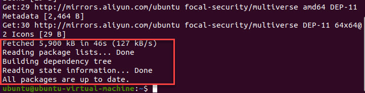
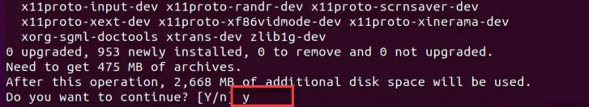
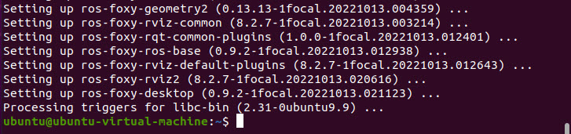
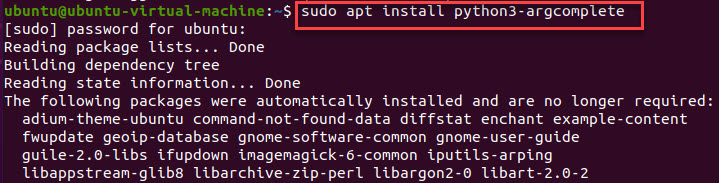
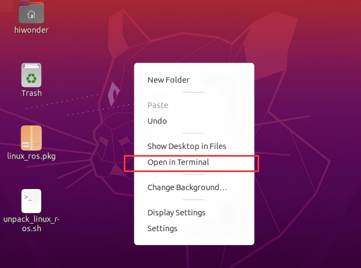
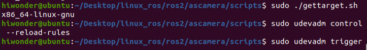
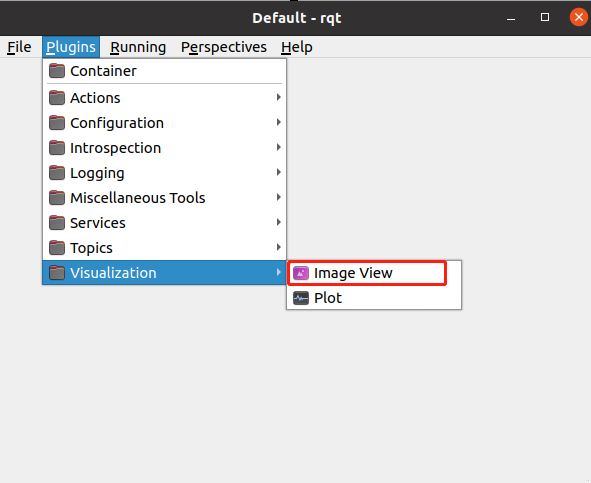
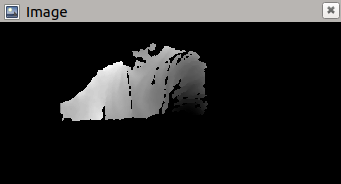
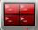
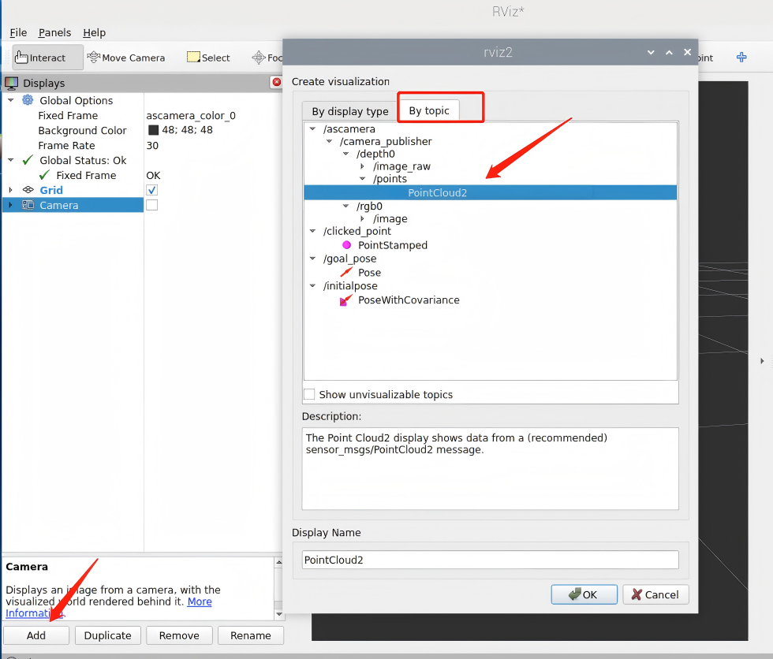

# 5. Depth Camera Basic Lesson

<p id="anchor_5_1"></p>

## 5.1 Test and Configure ROS2

### 5.1.1 Version Options

Different versions of ROS2 are installed on different versions of Ubuntu. In this section, we will use the virtual machine with Ubuntu 20.04, which corresponds to ROS2 Foxy.


### 5.1.2 Check Ubuntu's Software and Update Sources

(1) Locate **'System&Update'**.


(2) Make sure to check the option for internet downloads and change the download source to the local region's source.


### 5.1.3 Set Encoding Format

(1) Enable the virtual machine, and press "**Ctrl+Alt+T**" to open the terminal.

(2) Input

```bash
sudo locale-gen en_US en_US.UTF-8
```

Set the Ubuntu locale to en_US.UTF-8. After entering the command, press Enter, then enter the virtual machine's password, "**hiwonder**" (users should enter the password they have set for their own virtual machine; in our case, the password is "**hiwonder**").


(3) Run the command below and press Enter key to update the language environment.

```bash
sudo update-locale LC_ALL=en_US.UTF-8 LANG=en_US.UTF-8
```


(4) Enter the command, press Enter, and export the environment variables to take effect immediately.

```bash
export LANG=en_US.UTF-8
```

### 5.1.4 Set the Download Source for ROS2

* **Enable the Ubuntu Universe Repository** 

(1) Enter the command to check if the Universe repository is enabled:

```bash
apt-cache policy | grep universe
```

(2) If the output is as follows, it indicates that it has been enabled, and you can proceed to configure it further in section 1.4.1.


(3) If you see the following prompt, it means it has not been enabled.


(4) Enter the command to install the software package "**software-properties-common**":

```bash
sudo apt install software-properties-common
```


(5) Enter the command to add the PPA to the Universe repository and automatically import the public key:

```bash
sudo add-apt-repository universe
```


(6) You can enter the command again to check if it has been enabled:

```python
apt-cache policy | grep universe
```


* **Update the software packages and install the curl and gnupg tools** 

(1) Enter the command to update the software installation packages:

```bash
sudo apt update
```


(2) After the update is complete, it will appear as shown in the following image.



(3) Enter the command to install the curl and gnupg tools:

```bash
sudo apt install curl gnupg2 lsb-release
```


(4) During the installation process, if you see the prompt as shown in the following image, simply enter "**y**" and press Enter.


(5) After the installation is complete, it will appear as shown in the following image:


* **Set the public key** 

Enter the following command:

```bash
curl -s https://raw.githubusercontent.com/ros/rosdistro/master/ros.asc \| sudo apt-key add -
```


If the following error appears, re-enter the command:

```bash
curl http://repo.ros2.org/repos.key | sudo apt-key add -
```


* **Set Download Source** 

Enter the following command:

```bash
sudo sh -c 'echo "deb \[arch=\$(dpkg --print-architecture)\] http://packages.ros.org/ros2/ubuntu \$(lsb_release -cs) main" \> /etc/apt/sources.list.d/ros2-latest.list'
```


### 5.1.5 Install ROS2

(1) Enter the below command to update the software feature pack.

```bash
sudo apt update
```


(2) After the update is complete, it will appear as shown below.


(3) Run the below command:

```bash
sudo apt install ros-foxy-desktop
```

Press Enter. When prompted whether to install, type "**y**" and press Enter again. Wait for the download and installation to complete. Depending on your network conditions, this process may take about 10 minutes, so please be patient.




(4) After the installation is complete, it will appear as shown below.



### 5.1.6 Install Additional Dependency

(1) Enter the command, press Enter, and input the virtual machine password "**hiwonder**" to install the autocomplete tool:

```bash
sudo apt install python3-argcomplete
```



(2) After the installation is complete, it will appear as shown below.


(3) Input the following command and hit Enter key to install the compilation tool. Then enter 'y' to confirm the installation.

```bash
sudo apt install python3-colcon-common-extensions
```


(4) After the installation is complete, it will appear as shown below.


### 5.1.7 Set Environment Variables

Sequentially enter the following commands, pressing Enter after each one, to complete the environment variable setup:

```bash
echo "source /opt/ros/foxy/setup.bash" >> ~/.bashrc
```

```bash
source ~/.bashrc
```


### 5.1.8 Test ROS2 System

(1) Enter the command to run a talker.

```bash
ros2 run demo_nodes_cpp talker
```


(2) Press **"Ctrl+Alt+T"** to open a new terminal, then enter the command to run a listener.

```bash
ros2 run demo_nodes_py listener
```


(3) Press **"Ctrl+C"** to stop the execution. If stopping fails, you can repeat pressing **"Ctrl+C"** multiple times until it stops.

<p id="anchor_5_2"></p>

## 5.2 Depth Camera Configuration

### 5.2.1 Depth Camera Configuration

:::{Note}

* This document uses Ubuntu 20.04 and ROS2 Foxy as examples for installation. The system and ROS versions should not be lower than Ubuntu 20.04 and ROS2 Foxy, as software versions below these are outdated. Using outdated software means you will not receive security and maintenance updates, and compatibility issues will pose significant challenges, potentially leading to unsolvable problems.

* Before starting the configuration, please install virtual machine software and import Ubuntu 20.04. Refer to "[**Linux Basic Lesson**]()".

* Next, install ROS Foxy. Refer to "[**5.1 Test and Configure ROS2**](#anchor_5_1)" in the same path as this document. This document will not provide further details on the aforementioned installations.

:::

### 5.2.2 Network Configuration

(1) Open virtual machine .

(2) Click-on **"Edit"** and choose **"Virtual Network Editor"**.


(3) Tick **"Bridged"**, and choose the corresponding wireless network card.


(4) Select the imported virtual machine, then click on **"Power on this virtual machine"**.


(5) Click on  to open terminal. Or press the short-cut **"Ctrl+Alt+t"** to open the command-line terminal.

(6) Enter the command to check whether the network connection is successful.

```bash
ping www.baidu.com
```

If the terminal prints following content, that means network connection is successful.


If it shows that **"Name or service not known"**, that means virtual machine fails to connect to the network.


(7) Execute this step only when network connection is failed. Enter command "**ip a**" to check the ID of network card.

```bash
ip a
```


(8) Execute this step only when network connection is failed. Enter command and press Enter. "**ens33**" is the ID of network card. You need to modify the entered command based to suit the specific case at hand.

```bash
sudo dhclient ens33
```

Repeat step (6). If the terminal prints following content, that means network connection is successful.


### 5.2.3 Install Dependency

(1) Run the command  to update apt library.

```bash
sudo apt update
```

After update, the following messages will occur.


(2) Enter the following commands to install the dependency library:

```bash
sudo apt install libgflags-dev nlohmann-json3-dev libgoogle-glog-dev \\

ros-\$ROS_DISTRO-image-transport ros-\$ROS_DISTRO-image-publisher ros-\$ROS_DISTRO-camera-info-manager
```

### 5.2.4 Construct Workspace

(1) Execute the command to build the workspace.

```bash
mkdir -p ~/ros_ws/src && cd ~/ros_ws/src
```

(2) Execute the command to compile the new workspace. Ensure that the compilation is performed within the "**ros_ws**" workspace.

```bash
colcon build
```

(3) Run the command to set a new workspace.

```bash
. ./install/setup.bash
```

(4) Enter the command to append the initialization action of environment variables to the terminal initialization file.

```bash
echo "source \$HOME/ros_ws/install/setup.bash" >> ~/.bashrc
```

<p id="anchor_5_3"></p>

## 5.3 Install Depth Camera ROS SDK

Before starting, make sure to follow the instructions in the "[**5.2 Depth Camera Configuration**](#anchor_5_2)" in the same directory to set up the operating environment.

(1) Copy the "**linux_ros.pkg**" and "**unpack_linux_ros**" under the directory of "**linux_ros**" to the virtual machine.

The virtual machine account username is "**hiwonder**" and the password is also "**hiwonder**".

(2) Right-click the mouse to open the terminal.



(3) Enter the command to compress the "**linux_ros.pkg**" package.

```bash
./unpack_linux_ros.sh
```


(4) Enter the command to access the function pack.

```bash
cd linux_ros/ros2/
```

(5) Enter the command to copy the ROS package to the ROS environment and press "**Enter**".

```bash
cp -r ascamera build.sh run_ascamera_node.sh /home/hiwonder/ros_ws/
```

(6) Enter the command to navigate to the ROS workspace and press "**Enter**".

```bash
cd ./ascamera/scripts/
```

(7) Enter the command to import the rule file to the workspace. Press **"Enter"** and input the password **"hiwonder"**.

```bash
sudo cp angstrong-camera.rules /etc/udev/rules.d
```


(8) Enter the command to obtain the target platform for the local GCC compiler. Input the command to make it effective.

```bash
sudo ./gettarget.sh  
```

```bash
sudo udevadm control --reload-rules
```

```bash
sudo udevadm trigger
```



(9) Enter the command to modify the path of the configuration file.

```bash
gedit ..//launch/ascamera.launch.py
```

```bash
/home/hiwonder/ros_ws/ascamera/configurationfiles
```


(10) Run the command to navigate to the workspace.

```bash
cd ~/ros_ws/
```

(11) Enter the command to recompile the workspace.

```bash
./build.sh
```


(12) Enter the command to set the new workspace environment variables.

```bash
. ./install/setup.bash
```

(13) So far, we have completed the installation of the Depth Camera ROS2 SDK.

## 5.4 Usage of Depth Camera

Before starting, make sure that you have followed the "[**5.2 Depth Camera Configuration**](#anchor_5_2)" in the same directory as this lesson to set up the workspace. Ensure that you have successfully compiled the depth camera package based on "[**5.3 Install Depth Camera ROS SDK**](#anchor_5_3)".

### 5.4.1 Enable Camera Service

(1) Attach the depth camera to the computer and establish its connection with the virtual machine.


(2) Run the command to start the camera.

```bash
./run_ascamera_node.sh
```

We offer two approaches for image visualization. One option involves utilizing rqt_image_view to observe 2D images, while the alternative is to employ rviz for visualizing 3D images. You are free to select the method that aligns with your particular needs. It is crucial to emphasize that during image viewing, the camera service should remain active and not be closed.

* **View Image Using rqt_image_view Tool** 

(1) Open a new terminal, and execute the command to start the image viewing tool.

```bash
rqt
```

When the below interface appears, it means that the tool is started successfully.


Select "**Plugins \> Visualization \> Image View**".



(2) To view the infrared image, please select the corresponding topic.


(3) When viewing the depth map, the red box position needs to be set as shown in the following figure:


* **View Image Using rviz** 

(1) Execute the command to initiate the tool.

```bash
ros2 runrviz2rviz2
```

When the below interface appears, it means that the tool is started successfully.


(2) To access the camera feed, start by configuring the "**Fixed Frame**" to "**camera_link**." Then, click on "**Add**", select "**By topic -\> camera -\> color -\> Image_raw -\> Image**", and finally, click "**OK**".


When the interface below appears, it indicates that the tool has been successfully launched.


(3) To view the depth map, set **'Fixed Frame' as 'camera_link'**, then click-on 'Add' to select **'By topic -\>camera-\>depth-\>Image_raw-\>Image'**, and click-on **'OK'**.


When the interface below appears, it indicates that the tool has been successfully launched.



## 5.5 Data Type and Point Cloud

### 5.5.1 Introduction to Point Cloud

The things we observe with our eyes are three-dimensional, but in computer vision, using regular cameras only provides two-dimensional information about an object, which cannot achieve the same observation effect as human eyes. In order for computers to represent three-dimensional objects, computer vision needs to transition into three-dimensional vision, and point clouds are the way to express three-dimensional vision.

### 5.5.2 Understanding Point Cloud Data Types

Point cloud data refers to a collection of vectors in a three-dimensional coordinate system, typically expressed in the X, Y, and Z axes of the three-dimensional coordinate system. It is commonly used to represent the surface shape of an object. Point cloud data can also represent attributes such as RGB colors, grayscale values, depth, etc., of an object's surface.

Robot point cloud data is acquired through Lidar and depth cameras, both of which are capable of measurements.

Common formats for storing point cloud data include pts, asc, dat, stl, imw, xyz, txt, csv, and etc. Point cloud data, much like an attribute table, records the X, Y, Z positions of corresponding points along with various attributes associated with each point.

### 5.5.3 Point Cloud

* **Depth Camera Point Cloud** 

:::{Note}

This step is performed on the robot, and when entering commands, it's important to strictly differentiate between uppercase and lowercase letters. You can also use the "**Tab**" key to autocomplete keywords.

:::

(1) Start the robot and connect to the system desktop remotely using VNC.


(2) Click-on  to open the command-line terminal.

(3) Execute the below command and hit Enter key to disable the app auto-start service.

```bash
~/.stop_sh
```


(4) Open a new command-line terminal, and run the following command to open the depth camera service.

```bash
ros2 launch peripherals depth_camera.launch.py
```

(5) Open a new command-line terminal and execute the below command to initiate rviz.

```bash
rviz2
```

(6) Choose **"ascamera_color_0"**.


(7) Click on **"Add"** as shown below, then select **"By topic" -\> "ascamera" -\> "ascamera_publisher" -\> "depth0" -\> "points" -\> "pointCloud2"**, and finally click **"OK"**.



Once you've completed the previous settings, the point cloud will become visible.


(8) If you need to terminate the program, press short-cut "**Ctrl+C**" on the terminal.

After experiencing the Lidar game, you can activate the app service either by using a command or restarting the robot. If the app service is not activated, related app functions will be disabled. In the case of a robot restart, the app service will start automatically.

Click  and enter the command. Press enter to start the app, and wait for the buzzer to beep.

```bash
sudo systemctl restart start_node.service
```

## 5.6 Web Real-time Monitoring

### 5.6.1 Web Real-time Monitoring

After obtaining the camera information, the live camera feed can be transmitted to the local area network. The real-time monitoring can be achieved by viewing the robot's live feedback images through the webpage.

### 5.6.2 Enable Robot Auto-start Service

Robot's Camera Transmission Service:

(1) If the robot has not started up yet, switch it on. Then, you can ahead to "**[5.6.2 Enable Robot Auto-start Service -> Access Live Camera Feed Through Web](#anchor_5_6_2_1)**" to view the live camera feed through the browser.

(2) If the robot has already started up, please follow the steps below:

① Start MentorPi and connect it to the VNC.  

② Click  to open the command line terminal.  

③ Enter the command. Press "**Enter**" to start the robot's auto-start service. When the buzzer sounds a beep, the service restarts successfully.

sudo systemctl restart start_node.service


④ Then, you can proceed to "[**5.6.2 Enable Robot Auto-start Service -> Access Live Camera Feed Through Web**](#anchor_5_6_2_1)" to view the live camera feed through the browser.

<p id="anchor_5_6_2_1"></p>

* **Access Live Camera Feed Through Web** 

(1) Open any web browser, and input the IP address "**http://192.168.149.1:8080/**", then hit "**Enter**".

:::{Note}
If the prompt "**This site can't be reached**" occurs, please restart the app auto-start service.
:::

(2) Click-on "**image_raw(Snapshot)**" to access the live camera feed. The program currently only supports viewing RGB images.


